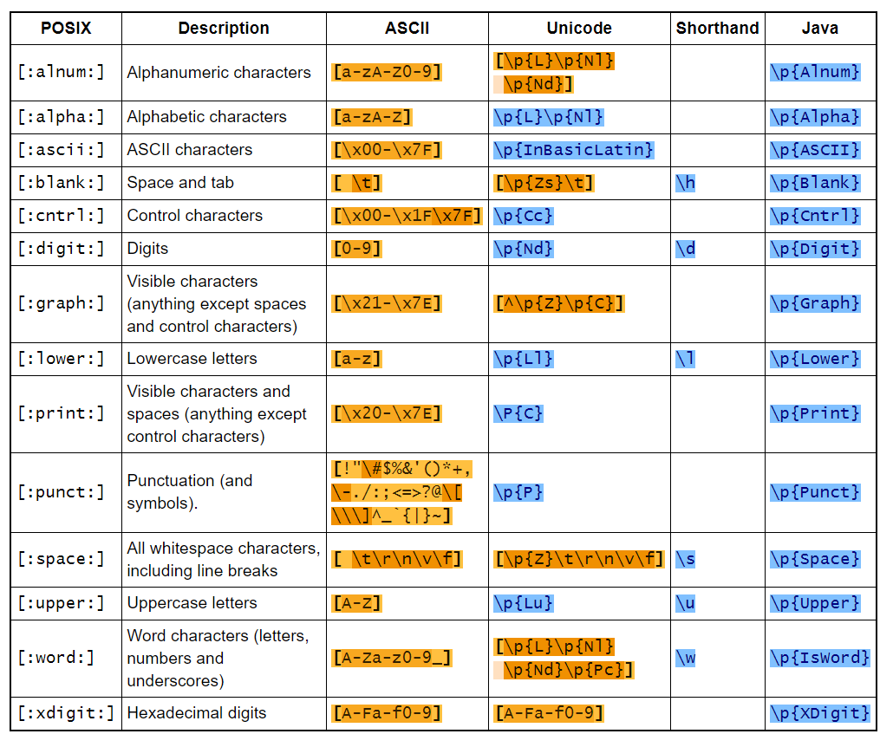
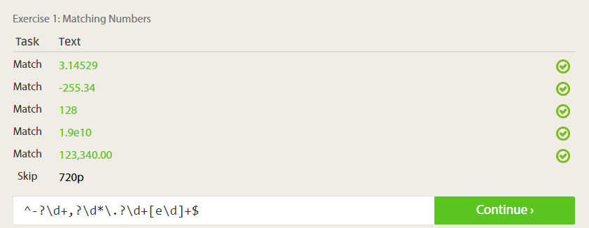
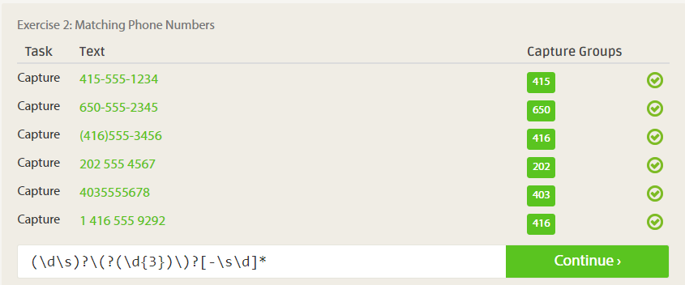
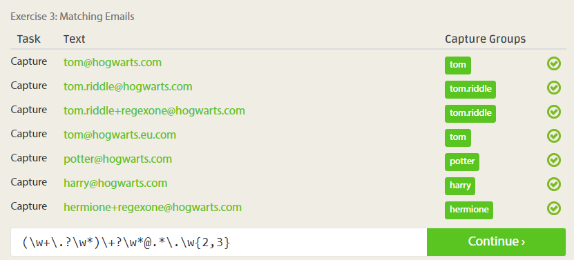
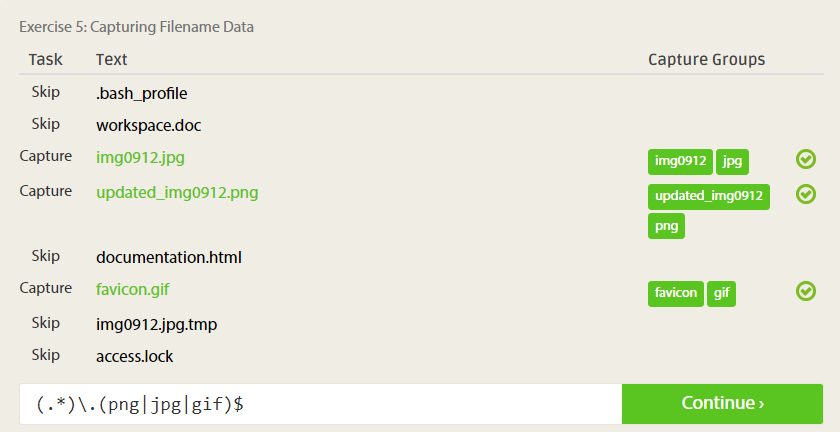
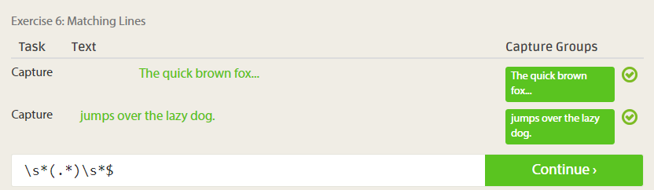
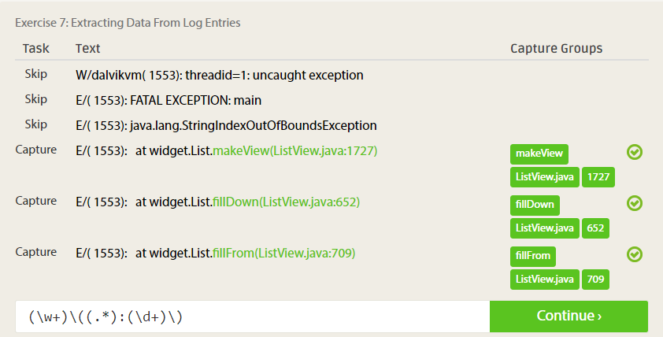
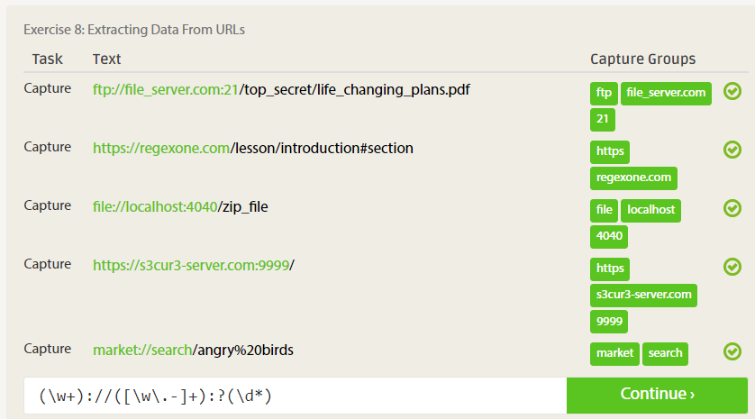

Регулярное выражение - это строка, которая является шаблоном для

Литерал - символ, который воспринимается, как символ

**Метасимволы** - символ, который воспринимается, как какой-то знак

- . - любой символ кроме разделителя строк

Чтобы читать символы, которые входят в перечень метасимволов, как обычные литералы, необходимо их экранировать с помощью обратного слеша или поместить между `\Q` и `\E`
```
\.
\Q.\E //Равнозначные конструкции
```

- `( )` - захватываемая группа - все символы заключенные в скобки рассматриваются как единое целое. Каждой захватываемой группе присваивается номер слева направо, начиная с 1
- `\1` - обращение к захватываемой группе под номером 1
- `[ ]` - набор символов. Символы указываются подряд без пробелов
```
[artyB] //Будет искаться совпадение по каждой букве из перечня
```

Поддерживается инверсия:
```
[^artyB] //Будет искаться совпадение по каждому символу, не входящему в перечень
```

Поддерживаются диапазоны:
```
[a-z] //Будут искаться все маленькие буквы английского алфавита
[a-c] //Эквивалентно [abc]
```

Диапазоны можно слиять
```
[a-zA-Z]
```

Диапазоны можно пересекать
```
[a-c&&b-f] //Поиск будет только по b и c
```

Стандартные классы символов:
- `\d` - цифра - эквивалентно `[0-9]`
- `\D` - не цифра - эквивалентно `[^0-9]`
- `\s` - пробельный символ - эквивалентно `[ \t\n\x0B\f]`
- `\S` - не пробельный символ - эквивалентно `[^\s]`
- `\w` - словообразующий символ - эквивалентно `[a-zA-Z_0-9]`
- `\W` - не словообразующий символ - эквивалентно `[^\w]`



### Граничные сопоставители:
- `^` - начало строки
- `$` - конец строки
- `\b` - граница слова
- `\B` - граница псевдослова
- `\A` - начало текста
- `\G` - конец предыдущего совпадения
- `\Z` - конец текста, не считая итогового разделителя строк
- `\z` - конец текста

## Квантификаторы
- Жадные - поиск самого длинного совпадения (режим по умолчанию)
    - `?` - одно или менее
    - `*` - ноль или более
    - `+` - одно или более
```
regex = "A.+a"; text = "Елена Алла Александр"
output = Алла Алекса //Захватил от первой А до последней а
```

- Ленивые - поиск самого короткого совпадения
    - `??` - одно или менее
    - `*?` - ноль или более
    - `+?` - одно или более
```
regex = "A.+a"; text = "Елена Алла Александр"
output1 = Алла // Захватил от первой А до первой а
output2 = Алекса // То же самое для оставшейся части строки
```

- Сверхжадные - выполняет одну попытку найти самое длинное совпадение
    - `?+` - одно или менее
    - `*+` - ноль или более
    - `++` - одно или более
```
regex = "A.+a"; text = "Елена Алла Александр"
output = пусто //потому что текст заканчивается не буквой а
```

- `{n}` - n раз
- `{n,}` - n раз и более
- `{n, m}` - не менее n раз и не более m раз

```
regex = "w{2,}"; text = "wazzzzup wazup"
output = zzzz //захватил буквы z, которые идут подряд не менее 2 раз
```

Применение: указывается квантификатор, а потом за ним последовательность символов для поиска
```
.*ox - ищет самую длинную последовательность символов, оканчивающуюся на ox
```

Работа квантификаторов отлично описана тут: https://javarush.ru/groups/posts/regulyarnye-vyrazheniya-v-java

### Флаговые выражения
- `(?i)` - нечувствительный к регистру английских символов поиск по шаблону
- `(?x)` - разрешает использование в регулярке комментариев, начинающихся с символа `#`
```
".at(?x)#match hat, pat tec." - ищет последовательности символов из 3 букв, оканчивающиеся на at
```

- `(?s)` - включает режим, при котором метасимвол `.` может принимать значение переноса строки
- `(?m)` - активирует многострочный режим, при этом `^` означает начало строки, а `$` - конец строки (а не начало и конец файла, как по умолчанию)
- `(?u)` - нечувствительный к регистру всех символов Юникода поиск по шаблону
- `(?d)` - активирует режим строк в стиле Unix (там не используется символ возврата каретки)

Можно указывать флаговые выражения друг за другом или вместе:
`(?i)(?u)` или `(?iu)`

Существует API по регулярным выражениям, находящаяся в пакете `java.util.regex`, она включает в себя три класса:
- `Pattern` - шаблоны
- `Matcher` - сопоставители
- `PatternSyntaxException` - описание недопустимых шаблонов

Примеры:









Примечание: в Java необходимо дублировать все обратные слеши, чтобы компилятор не подумал, что перед ним escape-последовательность.

## Pattern

Методы:
- `static Pattern compile(String regex)` - компилирует шаблон, сформированный из строки. Компиляция нужна для увеличения производительности поиска по шаблону
- `static Pattern compile(String regex, int flags)` - компилирует шаблон, сформированный из строки с учетом флагов
- `String pattern()` - возвращает скомпилированный шаблон в виде строки
- `int flags()` - возвращает флаги
- `Matcher matcher(CharSequence)` - возвращает сопоставитель, сформированный из строки
- `static boolean matches(String regex, CharSequence input)` - возвращает true, если в input есть соответствие регулярочке. Используется, когда не хочется создавать объекты
- `String[] split(CharSequence text)` - разбивает в соответствии с шаблоном и возвращает массив строк. При этом limit (см. следующий метод) принимается равным нулю
- `String[] split(CharSequence text, int limit)` - разбивает в соответствии с шаблоном и возвращает массив строк
    - `limit < 0` - выполняется поиск всех соответствий, длина массива может быть произвольной
    - `limit == 0` - выполняется поиск всех соответствий, пустые строки в конце отбрасываются
    - `limit > 0` - выполняется поиск не более, чем `limit-1` соответствий, длина массива не превышает `limit`
- `Predicate asPredicate()` - возвращает функцию с булевым значением true, если найдено совпадение

Флаги (являются константами, определенными в классе `Pattern`):
- CANON_EQ
- CASE_INSENSITIVE
- COMMENTS
- DOTALL
- LITERAL
- MULTILINE
- UNICODE_CASE
- UNICODE_CHARACTER_CLASS
- UNIX_LINES

Флаги можно комбинировать с помощью операции или:
```java
Pattern p = Pattern.compile("(?i)^\\.", CASE_INSENSITIVE | MULTILINE) //Здесь флаговое выражение дублирует один флаг
```

Некоторые константы дублируют флаговые выражения

## Класс Matcher

Методы:
- `boolean find()` - ищет первое совпадение, если нашел, то возвращает true
- `boolean find(int start)` - ищет первое совпадение в тексте, начиная с символа с переданным номером, если нашел, то возвращает true
- `boolean matches()` - возвращает true, если текст целиком соответствует шаблону
- `boolean lookingAt()` - возвращает true, если любая часть текста соответствует шаблону
- `String group()` - возвращает предыдущий найденный объект с учетом метасимволов. Если поиск еще не проводился и окончился неудачно, то выкидывается IlligalStateException
- `String group(int index)` - возвращает найденный объект с указанным индексом. Если индекс не соответствует количеству найденных совпадений, то выкидывается IndexOutOfBoundsException
- `String group(String name)` - возвращает найденный объект группы name (что это значит?). Если захватываемой группы name в шаблоне нет, то выкидывается IlligalArgumentException
- `int groupCount()` - возвращает число совпадений
- `int start()` - возвращает номер первого символа первого обнаруженного объекта в строке
- `int start(int index)` - возвращает номер первого символа обнаруженного объекта с указанным индексом в строке
- `int start(String name)` - возвращает номер первого символа обнаруженного объекта с указанным именем в строке
- `int end()` - возвращает номер последнего символа обнаруженного объекта в строке
- `int end(int index)` - возвращает номер последнего символа обнаруженного объекта с указанным индексом в строке
- `int end(String name)` - возвращает номер последнего символа обнаруженного объекта с указанным именем в строке
- `reset()` - сбрасывает сопоставитель, возвращает индекс рассматриваемого символа в 0
- `reset(CharSequence text)` - сбрасывает сопоставитель и задает ему новый текст для обработки
- `void appendReplacement(StringBuffer text, String replacemant)` - заменяет в тексте, все что соответствует шаблону, на строку
- `String replaceFirst(String replacement)` - заменяет в тексте первое совпадение на указанный текст и возвращает исправленный текст. Исходный текст при этом не меняется
- `String replaceAll(String replacement)` - заменяет в тексте все совпадения на указанный текст и возвращает исправленный текст. Исходный текст при этом не меняется

Пример:
```java
//Программа, распознающая цифры, операции над ними и вычисляющая результат
String string = "3 + 6 = ";
Pattern pattern = Pattern.compile("(\\d+) ([\\+\\-\\*]) (\\d+)");
Matcher matcher = pattern.matcher(string);
matcher.find();
int a = Integer.parseInt(matcher.group(1));
String sign = matcher.group(2);
int b = Integer.parseInt(matcher.group(3));
int sum = 0;
switch (sign) {
    case "+":
        sum = a + b;
        break;
    case "-":
        sum = a - b;
        break;
    case "*":
        sum = a * b;
        break;
}
System.out.println(a + " " + sign + " " + b + " = " + sum); //Выведет 3 + 6 = 9
```

## PatternSyntaxException

При возникновении ошибок при парсинге строк с помощью регулярных выражений выбрасывается исключение `PatternSyntaxException`.
При обработке исключения из него можно вытащить информацию с помощью методов:
- `getDescription()` - возвращает описание ошибки
- `getIndex()` - возвращает индекс символа в котором произошла ошибка, или -1, если место неизвестно
- `getPattern()` - возвращает регулярное выражение

## Рекомендации

Создавая регулярные выражения лучше их закомментировать, чтобы коллеги смогли понять или ты сам через пару дней смогли вспомнить, что эта регулярка делает, не сломав мозг.

---
## К изучению
- [ ] [https://javarush.ru/groups/posts/regulyarnye-vyrazheniya-v-java
- [X] https://javarush.ru/groups/posts/136-reguljarnihe-vihrazhenija-v-java-chastjh-1
- [ ] https://habr.com/ru/company/badoo/blog/343310/
- [ ] https://habr.com/ru/post/115825/
- [X] https://regexone.com/
- [ ] Джеффри Фридл - Регулярные выражение