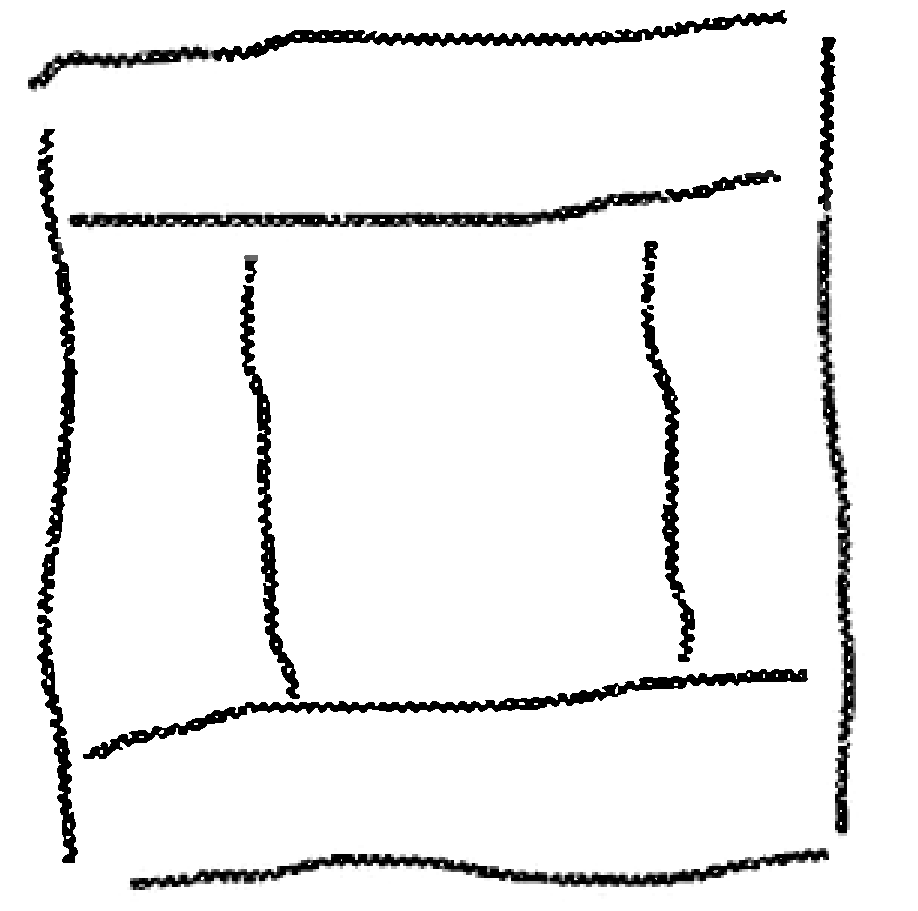

**Основные контейнеры Swing:**

- Контейнеры верхнего уровня (не могут быть вставлены куда-либо еще):
    - JFrame - окно на экране (используется чаще всего)
    - JApplet - таким образом создаются апплеты
    - JWindow
    - JDialog
- Контейнеры нижнего уровня:
    - JRootPane - корневая панель, находится на вершине иерархии панелей. Включает в себя стеклянную панель, панель содержимого и многослойную панель
    - JPanel - панель, которая обычно используется для размещения на ней других компонентов
    - JScrollPane - панель с полосами прокрутки

**Менеджеры (диспетчеры) компоновки:**

Компоненты на форме располагаются не так, как хочет программист, а так, как распорядится менеджер компоновки. Программист может только сообщить желаемые размеры компонента, а диспетчер компоновки соглашается или не соглашается с этими желаемыми размерами, в зависимости от контекста.

- BorderLayout - компоновщик по умолчанию. Располагает компоненты по центру и по 4 частям света
- FlowLayout - размещает компоненты слева направо и сверху вниз. Элемент переносится вниз, если не помещается на текущем уровне
- BoxLayout - располагает компоненты в вертикальном и горизонтальном направлении (почти как FlowLayout, только лучше)
- GridLayout - располагает компоненты в ячейках сетки
- GridBagLayout - располагает компоненты в ячейках сетки с регулируемыми размерами
- SpringLayout - располагает компоненты с учетом ряда ограничений

Менеджеры компоновки можно отключить, вызвав метод setLayout(null), при этом компоненты можно будет располагать так, как душе заблагорассудится, но рекомендуется использовать менеджеры компоновки для исключения взаимопересечения и перекрытия компонентов.

**Основные компоненты Swing:**

- JButton - кнопка
- JRadioButton - радио-кнопка
- JCheckBox - флажок
- JLabel - надпись
- JList - список с возможностью выборов одного или нескольких элементов
- JSlider -
- JTextField - поле для ввода одной строки
- JTextArea - поле для ввода большого количества строк
- JTable -

**Класс JFrame**
Класс описывает окошки
Конструкторы:

- JFrame() - пустой конструктор
- JFrame(String title) - задает название окошка (отображается в верхней панельке)

Методы:

- void repaint() - перерисовывает все окошко
- void setSize(int, int) - задает размеры окна в пикселях
- void setVizible(boolean) - задает видимость окна (по умолчанию - невидимый)
- Layout getContentPane() - возвращает менеджера компоновки
- void setContentPane(Layout ???) - задает панель содержимого
- void setLayout(Layout) - задает менеджер компоновки
- void setDefaultCloseOperation(JFrame const) - задает что должно произойти при закрытии окна пользователем:
    - EXIT_ON_CLOSE - выходит из окна окончательно
    - DISPOSE_ON_CLOSE
    - HIDE_ON_CLOSE - сворачивает непонятно куда
    - DO_NOTHIG_ON_CLOSE - ничего не происходит
- void setBounds(int x, int y, int width, int heigth) - устанавливает начальное положение левого верхнего угла фрейма на экране и его желаемые размеры.
- void setLocation(int x, int y) - устанавливает начальное положение на экране левого верхнего угла фрейма
- void pack() - подгоняет размеры окна под желаемые размеры входящих в него компонентов

**Класс BorderLayout**

Располагает компоненты по центру и по 4 частям света - 



Является диспетчером по умолчанию для фрейма.
Конструкторы:

- `BorderLayout(Container, )`

Методы:

- void add(BorderLayout const, Component) - располагает компонент в выбранной части
    - NORTH - компонент растягивается по горизонтали и получает необходимую высоту
    - EAST - компонент растягивает по вертикали и получает необходимую ширину
    - SOUTH - компонент растягивается по горизонтали и получает необходимую высоту
    - WEST - компонент растягивает по вертикали и получает необходимую ширину
    - CENTER - компонент растягивается по всей незанятой области
- pack() - выстраивает все части относительно центра

**Класс FlowLayout**

Располагает компоненты слева направо и сверху вниз, перенося их на новую строку, если они не помещаются по горизонтали. Класс дает компонентам предпочитаемый ими размер по обоим направлениям.

Является диспетчером по умолчанию для панели JPanel.

**Класс BoxLayout**

Располагает компоненты в вертикальном и горизонтальном направлении. Можно принудительно перенести компонент на строку ниже

Конструкторы:

- BoxLayout(Component, BoxLayout const) - передаем компонент, для которого будет использоваться менеджер компоновки, и направление, по которому будут размещаться элементы
    - Y_AXIS - по оси Y
    - X_AXIS - по оси Х

Методы:
-

**Класс GridLayout**
Конструкторы:

- GridLayout(int rows, int columns) - создает менеджера компоновки с заданным количеством рядов и колонок

Методы:

- void setVgap(int) - устанавливает вертикальный интервал между компонентами
- void setHgap(int) - устанавливает горизонтальный интервал между компонентами

**Класс JPanel**

Обычно используется для рисования. Панелью по умолчанию управляет диспетчер FlowLayout.

Конструкторы:

- JPanel() - пустой
- JPanel(Layout) - можно задать диспетчер компоновки

Методы:

- void setBackground(Color) - устанавливает цвет панели
- void setLayout(Layout) - устанавливает менеджера компоновки для панели
- void setBorder(Border) -

**Класс JScrollPane**

Служит для помещения в него элементов, которые могут не поместиться полностью в окошко, для того чтобы эти элементы можно было прокрутить.

Конструкторы:

- JScrollPane(Component) - в конструктор передается тот компонент, который нуждается в прокрутке (например JList)

Методы:

- void setPrefferedSize(Dimension) - задаются предпочтительные размеры прокручиваемой панели
- void setVerticalScrollBarPolicy(ScrollPaneConstants) - устанавливает принцип работы вертикальной полосы прокрутки
- void setHorizontalScrollBarPolicy(ScrollPaneConstants) - устанавливает принцип работы горизонтальной полосы прокрутки
        - VERTICAL_SCROLLBAR_ALWAYS - вертикальная полоса прокрутки всегда будет видна (даже если область не заполнена)
        - HORIZONTAL_SCROLLBAR_NEVER - отключает горизонтальную полосу прокрутки

**Класс JButton**
Методы:

- void addActionListener(Listener) - добавляет обработчика событий к кнопке. Здесь можно использовать [Лямбда-выражения](stream_and_lambda/lambda_expressions.md)

```java
button1.addActionListener(e -> {
    x = x + y;
    frame.repaint();
});
```

- void setActionCommand(String) - задает команду действия (служит для различия между собой текстовых полей)
- String getActionCommand() - возвращает команду действия

**Класс JTextField**
Используется для ввода пользователем различных данных
Конструкторы:

- JTextField(int) - задается ширина текстового поля. Ширина задается в символах
- JTextField(String, int) - задается начальная фраза и ширина текстового поля

Методы:

- void setText(String) - задает текст, который будет выведен в текстовом поле по умолчанию
- String getText() - возвращает текст, введенный в поле
- void setActionCommand(String) - задает команду действия (служит для различия между собой текстовых полей)
- String getActionCommand() - возвращает команду действия
- void addActionListener(Listener) - добавляет обработчика события (можно использовать [Лямбда-выражения](stream_and_lambda/lambda_expressions.md))
- void selectAll() - выделяет весь текст в поле
- void requestFocus() - помещает курсор в поле

**Класс JTextArea**
Текстовая область для ввода нескольких строк текста
Конструкторы:

- JTextArea(int numberOfStrings, int width) - устанавливает размеры области: начальное количество строк и ширина в символах

Методы:

- void setLineWrap(boolean) - включает/отключает перенос строк внутри области
- void setText(String) - задает текст
- void append(String) - добавляет текст к имеющемуся
- void selectAll() - выделяет весь текст в области
- void requestFocus() - помещает курсор в область

**Класс JCheckBox**

Флажок - это особая разновидность кнопки. При установке или отжатии флажка формируется событие ItemEvent.

Конструкторы:

- JCheckBox(String) - создает флажок с пояснительной надписью

Методы:

- String getText() - возвращает пояснительную надпись
- void setText(String) - меняет пояснительную надпись на переданную
- boolean isSelected() - возвращает состояние флажка (нажат, отжат)
- void setSelected(boolean) - устанавливает значение значка (по умолчанию - выкл.)
- void addItemListener(Listener) - устанавливает обработчик событий (можно использовать [Лямбда-выражения](stream_and_lambda/lambda_expressions.md))

**Класс `JList<E>`**
Список с возможностью выборов одного или нескольких элементов.

Класс является обобщенным, это значит, что в нем могут быть объекты любого класса. Отображаться в списке объекты будут все равно как String.

Обычно компонент JList помещают в JScrollPane, чтобы можно было прокрутить элементы, если их слишком много.

При выборе элемента списка формируется событие ListSelectionEvent.
Конструкторы:

- JList(E[]) - передается массив объектов

Методы:

- void setSelectionMode(ListSelectionModel const) - устанавливает как можно выбирать элементы списка
    - SINGLE_SELECTION - можно выбрать один элемент
    - SINGLE_INTERVAL_SELECTION - можно выбрать один диапазон
    - MULTIPLE_INTERVAL_SELECTION - (установлен по умолчанию) можно выбрать несколько диапазонов
- int getSelectedIndex() - возвращает индекс первого выбранного элемента, если ничего не выбрано, то вернется -1
- int[] getSelectedIndices() - возвращает массив с индексами выбранных элементов. Массив упорядочен по возрастанию. Если ничего не выбрано, то возвращается массив нулевой длины.
- void setVisibleRowCount(int) - устанавливает количество строк, видимых одновременно
- void addListSelectionListener(Listener) - задает обработчика событий (можно использовать [Лямбда-выражения](stream_and_lambda/lambda_expressions.md))

**Класс Graphics**
Один из самых важных классов в GUI.
Используется для рисования, вставки изображений и пр.
Методы:

- Рисование:
    - void setColor(Color const) - устанавливает цвет пера, которым потом будет происходить рисование
    - void fillRect(int startX, int startY, int width, int heigth) - рисует залитый прямоугольник тем цветом, который был выбран ранее
    - void drawLine()
    - void drawPolygon()
    - void drawRect()
    - void drawOval()
    - void fillRoundRect()
- Готовые изображения:
    - void drawImage(Image, int startX, int startY, Component) - размещает выбранную картинку в компоненте в выбранных координатах

**Класс Graphics2D**
Является наследником Graphics.
В дополнение к родительским в классе определены следующие методы:

- void fill3DRect() -
- void draw3DRect() -
- void rotate(double theta, int centerX, int centerY) - все что будет в дальнейшем нарисовано, будет развернуто относительно указанного центра на угол, заданный в радианах.
- void scale() -
- void shear() -
- void transform() -
- void setRenderingHints() -

**Класс Color**

В нем в качестве констант определены все основные цвета, но можно создавать и свои собственные цвета

Конструкторы:

- Color(int red, int green, int blue) - создает цвет в формате rgb, при этом значения каждого цвета должны быть заданы от 0 до 255.
- Color(int red, int green, int blue, int alpha) - то же, что и предыдущий, но еще можно задать прозрачность. 0 - полностью прозрачный, 255 - полностью непрозрачный

**Класс Font**

Определяет шрифты. Шрифт можно менять в компонентах с использованием их метода setFont(Font).

Конструкторы:

- Font(String name, Font const, int heigth) - устанавливает шрифт с выбранным названием, определенной высоты, при этом применяет к нему некоторое форматирование, определяемое константами:
    - BOLD - жирный

**Класс JOptionPane**

Класс используется для создания всплывающих окошек, которые информируют пользователя о чем-либо.

Создание всплывающих окошек производится с помощью статического метода
Методы:

- static showMessageDialog(Component, Object message, String title, JOptionPane const) - выводит окошко
    - ERROR_MESSAGE
    - INFORMATION_MESSAGE
    - WARNING_MESSAGE
    - QUESTION_MESSAGE
    - PLAIN_MESSGE