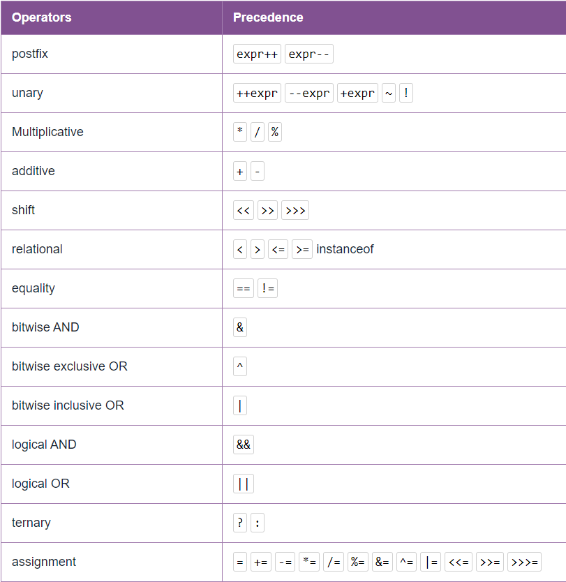

## Арифметические операции
- `+` - сложение;
- `-` - вычитание;
- `*` - умножение;
- `/` - деление;
- `%` - остаток от деления;
- `=` - оператор присваивания;
- `+=` - увеличение текущего значения переменной на количество после оператора;
- `-=` - аналогично предыдущему;
- `*=` - аналогично предыдущему;
- `/=` - аналогично предыдущему;
- `%=` - аналогично предыдущему;
- `++` - инкремент (от положения зависит возврат значения)
- `--` - декремент (от положения зависит возврат значения)

## Побитовые операции
Существует специальный синтаксис для битовых операций.
Подробнее о нем в заметке [Битовые операции](bit_operations.md).

## Вещественные числа
- `0.5` - запись числа 0,5;
- `5e-1` - еще один вариант записи числа 0,5.

## Логические операторы
- `==` - сравнение. Сравнивает примитивы и проверяют ссылаются ли переменные на один и тот же объект.
- `||` - или (наименьший приоритет выполнения)
```java
x || y
```
Вычисляется по упрощенной схеме. Если левый операнд true, то всему выражению присваивается true

- `&&` - и (средний приоритет выполнения)
```java
x && y
```

Вычисляется по упрощенной схеме. Если левый операнд false, то всему выражению присваивается false

- `!` - не (наивысший приоритет выполнения)
```java
!x
```

- `^` - исключающее или
```java
x ^ y
```

- `&` - и. Предназначено для вычисления по полной схеме
- `|` - или. Предназначено для вычисления по полной схеме

Сокращенный вид записи логических выражений:
```java
value &= expression // value = value & expression
value |= expression // value = value | expression
value ^= expression // value = value ^ expression
```

## Операторы сравнения
- `>` - строго больше
- `<` - строго меньше
- `>=` - больше или равно
- `<=` - меньше или равно
- `==` - сравнение на равенство
- `!=` - сравнение на неравенство
- `instanceof` - определяет принадлежит ли объект указанному классу или его предку

## Комментарии
`//` - текст за этим символом в строке не будет рассматривать компилятором
```java
int x = 5 //Присвоение переменной значения
```

Многострочные комментарии записываются следующим образом
```java
/*
Многострочный
комментарий
*/
```

Подробнее про комментарии тут:  [Комментарии](comments.md)

## Приоритет операций

