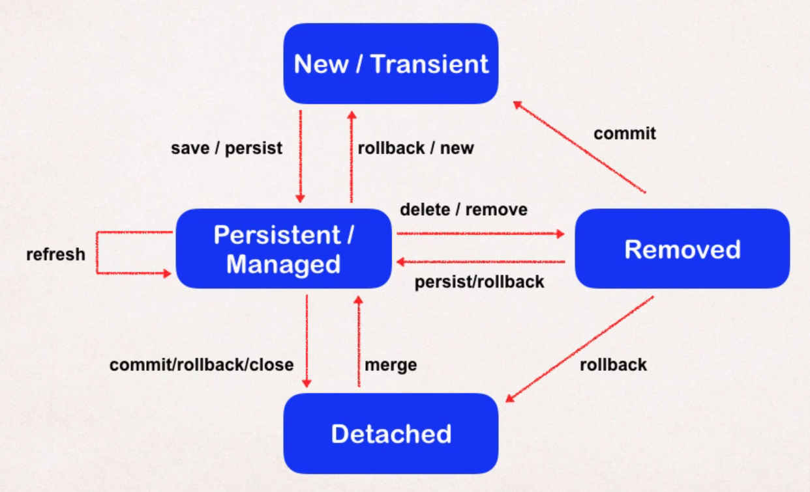

В JPA все субъекты предметной области описываются с помощью специальных классов. Самые главные модельные классы, представляющие собой какой-то важный объект доменной области (пользователь, товар, заявка, тестовое задание и др.) называются сущностями.

Субъекты, являющиеся зависимыми в своем жизненном цикле от сущностей называются встраиваемыми классами.

---
## Сущность Entity

Entity - **Сущность** - вид класса, объекты которого могут быть сохранены в базу данных.

Классы Entity должны подчиняться определенным правилам:

- в классе должен быть публичный конструктор без аргументов.
- в классе не должно быть final полей и методов.
- поля должны быть приватными
- если планируется передавать сущность через удаленный интерфейс, то класс сущности должен быть сериализуем, т.е. реализовывать интерфейс `Serializable`.

Класс помечается аннотацией `@Entity`.

В классе должно быть поле, которое выступает в роли первичного ключа, такое поле помечается аннотацией `@Id`.

Почти всегда значения идентификатора назначаются не вручную, а автоматически. Для этого над полем первичного ключа вешается аннотация `@GeneratedValue`. При этом существуют различные стратегии генерации первичного ключа, об этом см. [JPA. Настройка первичного ключа](jpa_primary_key.md).

Для того чтобы защитить код от ошибок при рефакторинге, рекомендуется ставить над каждым полем аннотацию `@Column` с указанием имени атрибута таблицы. Таким образом при изменении имени переменной, JPA будет знать к какой колонке таблицы БД относится данное поле.

```java
@Entity
@Table(name = "musicians")
public class Musician {
    @Id
    @GeneratedValue
    @Column(name = "id")
    private int id;

    @Column(name = "name")
    private String name;

    @Column(name = "band")
    private String band;
}
```

### Доступ к полям

Все поля в сущностях по соглашению обязаны быть объявлены приватными. Тогда как ORM получает доступ к ним? Это зависит от того, где установлена аннотация `@Id`. Если эта аннотация стоит над полем идентификатора, то ORM получает доступ к полям сущности с помощью рефлексии. Если аннотация `@Id` стоит над геттером, то ORM получает доступ к полям сущности с помощью методов доступа.

Для более гибкой настройки способов доступа к различным полям используется аннотация `@Access`. Аннотацию нужно ставить над полем и передавать ей одно из двух возможных значений:

- `FIELD` - доступ к полю через рефлексию
- `PROPERTY` - доступ будет осуществляться за счет геттеров и сеттеров

```java
@Access(value = AccessType.PROPERTY)
private String name;

public void setName(final String name) {
    this.name = this.sex == Sex.MALE
        ? "Mr. " + name
        : "Ms. " + name;
}
```

### Связи между сущностями

Cущности могут быть связаны между собой различными видами связей:

- Один к одному
- Один ко многим
- Многие ко многим

Подробнее о видах связи и их настройке в Java-коде см. в [JPA. Связи между сущностями](jpa_join_entities.md).

### Жизненный цикл

<mark>Это вообще JPA или Hibernate?</mark>
Состояния:

- `New` / `Transient` - новая сущность
- `Managed` / `Persistent` - сущность, над которой ведется работа
- `Be Removed` - сущность, которая должна быть удалена из БД.
- `Detach` - сущность не привязана к сессии.

Операции:

- `Detach` - отвязывает сущность от сессии. Изменение полей сущности не влияет на состояние БД. Отвязывание сущности от сессии происходит после коммита.
- `Merge` (операция) - привязывает к сессии сущность, находящуюся в состоянии Detach.
- `Persist` - переводит сущность из состояния New в состояние Managed. Следующим коммитом сущность будет сохранена в БД.
- `Remove` - переводит сущность из состояния Managed в Be Removed. При следующем коммите сущность будет удалена из БД.
- `Refresh` - обновляет данные о сущности из БД.



---
## Встраиваемые классы

Встраиваемые классы (типы-значения) - это такие классы, которые привязаны своим жизненным циклом к какой-либо сущности. Например, класс `FullName`, инкапсулирующий информацию об имени человека, привязан к жизненному циклу сущности `User`.

Поля встраиваемого класса отображаются на таблицу той сущности, которой он принадлежит.

Встраиваемые классы помечаются аннотацией `@Embeddable`.
```java
@Embeddable
public class FullName {

    @Column(name = "firstname")
    private String firstName;

    @Column(name = "surname")
    private String surname;

    @Nullable
    @Column(name = "patronymic")
    private String patronymic;

    /* */
}
```

В классе сущности для того, чтобы использовать поле с объектом встраиваемого класса, над ним нужно повесить аннотацию `@Embedded`.
```java
@Entity
@Table(name = "user")
public class User {

    /* */

    @Embedded
    private FullName fullName;

    /* */
}
```

Встраиваемые классы могут встраиваться в несколько различных сущностей. При этом, чтобы переопределить названия столбцов в базе данных для каждой сущности по-своему используется аннотация `@AttributeOverrides`, которая проставляется над полем встраиваемого класса в сущности:
```java
    @Embedded
    @AttributeOverrides({
        @AttributeOverride(name = "firstName", column = @Column(name = "user_firstname")),
        @AttributeOverride(name = "surname", column = @Column(name = "user_surname")),
        @AttributeOverride(name = "patronymic", column = @Column(name = "user_patronymic"))
    })
    private FullName fullName;
```

---
## Описание таблиц БД с помощью сущностей

Иногда бывают необходимы базы данных, срок жизни которых ограничен сроком жизни приложения. Такой базой данных может являться, например, H2.

Для создания таблиц, первичных и внешних ключей, индексов, ограничений целостности в таких базах данных можно использовать инструменты, предоставляемые JPA. Делается это с помощью аннотаций, проставляемых над классом сущности и его полями.

<mark>Дописать, когда будет необходимость и вынести в отдельную заметку</mark>
`@TableGenerator`
`@SequenceGenerator`

---
## К изучению

- [ ] Javadoc на классы `javax.persistence`
- [ ] Книга "Java Persistence API и Hibernate" в части касающейся
- [X] Управление сущностями, состояние сущностей: https://easyjava.ru/data/jpa/jpa-entitymanager-upravlyaem-sushhnostyami/
- [X] Встраиваемые классы https://www.baeldung.com/jpa-embedded-embeddable