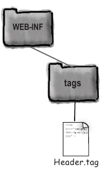

**Tag Files** - файлы с html-разметкой, которые служат для вставки в [JSP](jsp.md) с помощью пользовательских тегов.

Tag Files были придуманы для дизайнеров, чтобы они могли разрабатывать кастомные теги без написания Java-кода.

Использование Tag Files очень похоже на директиву `include` в JSP.

Tag Files имеют расширение .tag и их обычно группируют в папку `tags`, находящуюся внутри WEB-INF.



Для подключения Tag File в JSP необходимо подключить папку tags с помощью директивы taglib и атрибута *tagdir*. Вызов фрагмента осуществляется по его имени:

```jsp
<%@ taglib prefix="myTags" tagdir="/WEB-INF/tags" %>
<html><body>
    <myTags:Header />
</html></body>
```

---
### Передача данных в Tag Files

При подключении какого-либо фрагмента иногда может возникнуть необходимость передать ему какие-либо параметры для динамической генерации содержимого.

Сделать это можно несколькими способами:

- с помощью атрибутов
- с помощью тела тега

### Передача данных с помощью атрибутов

Параметры передаются непосредственно в теге вызова Tag File с помощью именованных атрибутов:

```jsp
<myTags:Header myParam1="value1" myParam2="value2" />
```

Внутри Tag File значения параметров можно получать по их имени с помощью [expression language](expression_language.md).

```jsp
<h1>${myParam1} better than ${myParam2}</h1>
```

### Передача данных с помощью тела тега

Информация в JSP передается в теле тега:
```jsp
<myTags:Header>
    Some text ...
</myTags:Header>
```

При этом в .tag-файл доступ к телу осуществляется с помощью [JSP Actions](jsp_actions.md) `<jsp:doBody>`

```jsp
<h1><jsp:doBody /></h1>
```

---
## Директива `attribute`

Для того чтобы описать возможные атрибуты и их характеристики в Tag File используется директива `attribute`.

```jsp
<%@ attribute name="subTitle" required="true" rtexprvalue="true" %>
```

Названия параметров, присущих атрибутам, аналогичны тем, что используются при описании атрибутов при использовании [Tag Library Descriptor](tag_library_descriptor.md).

---
## Директива tag
Данная директива является аналогом директивы page в JSP.
В директиве определены следующие атрибуты:

- `body-content` - определяет что может быть передано в теле тега. Возможные значения: empty, scriptless, tagdependent. Значение по умолчанию - scriptless.

```jsp
<%@ tag body-content="tagdependent" %>
```

---
## К изучению

- [ ] Глава 10 Head First Servlets and JSP