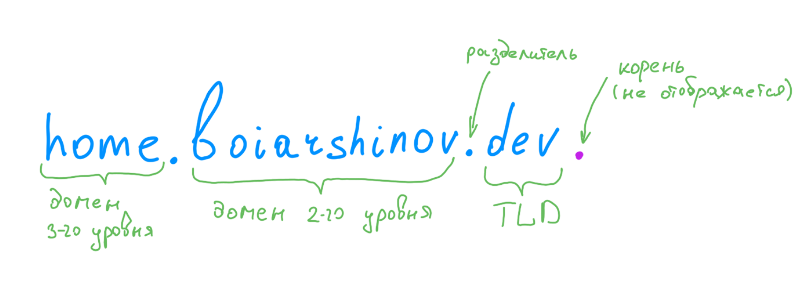
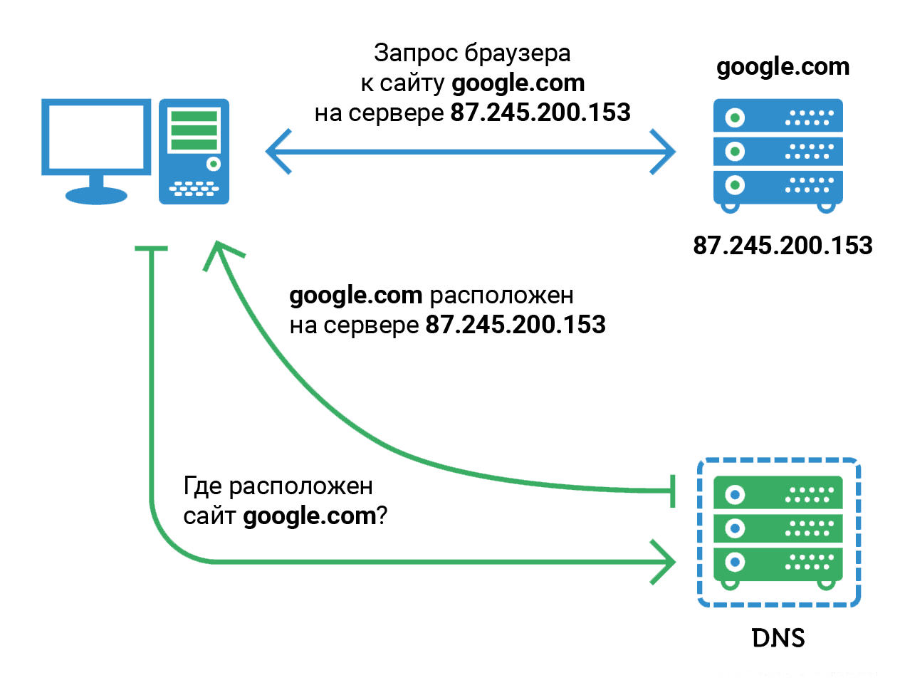

# DNS

Адресом какого-либо ресурса в сети Интернет является [IP-адрес](./ip_address.md), выражаемый 4 байтами.
Такие адреса хороши для машинной обработки, а вот людям пользоваться таким адресом неудобно.
Поэтому были придуманы текстовые доменные имена, управляемые __DNS__ - Domain Name System.

Доменные имена представляют собой символьную строку.
Возможные символы: [a-z0-9-.].
Доменные имена нечувствительны к регистру, т.е. заглавные буквы воспринимаются так же, как строчные.
Точка является разделителем, а блоки между точками называются метками.
Самая правая метка является родительским доменом.

Домены подразделяются на уровни.
Домены, состоящие из одной метки, называются Доменами Высшего/Верхнего Уровня (__TLD__ - top level domain) или доменной зоной.



Раздачей TLD занимается некоммерческая организация ICANN.
Большинство TLD отданы различным компаниям на условиях, что они будут позволять регистрировать субдомены в этой доменной зоне кому угодно.
Такими TLD являются, например: `org`, `com`, `dev` и т.д.
Ряд TLD отдан американским бюджетным учреждениям: `mil`, `edu`, `gov`.
Также для каждой страны создана двухбуквенная доменная зона, управление которой отдано правительству данной страны: `ru`, `us`, `by`, ...


---
## DNS server

Сопоставлением доменного имени с IP-адресом занимаются специальные сервисы - DNS-server.

DNS сервера хранят данные сопоставления в следующем формате:
```
github.com.        A 140.82.121.4
google.com.       NS ns1.google.com
ns1.google.com. AAAA 2001:4860:4802:34::a
```

- `A` - для IP адресов
- `AAAA` - для IPv6 адресов
- `NS` - для редиректа на другой DNS-сервер
- `MX` - для почтовых адресов

Каждый DNS-сервер отвечает только за свой поддомен.
Так что можно сказать, что DNS - это распределенная база данных.

Поиск адреса по доменному имени происходит следующим образом: допустим, клиент хочет найти IP адрес домена `home.boiarshinov.dev`.
Клиент обращается к известному ему DNS-серверу.
Тот ничего не знает про такое доменное имя, но знает, что за TLD `dev` отвечает другой DNS-сервер.
Если изначальный DNS-сервер поддерживает рекурсию, то он самостоятельно сходит на DNS-сервер домена `dev`, и узнает у него адрес DNS-сервера, ответственного за домен `boiarshinov.dev`.
А затем сходит на него, получит искомый IP и вернет пользователю.

Если DNS-сервер не поддерживает рекурсию, то обход всех DNS-серверов лежит на клиенте.
DNS-сервера и клиентские приложения как правило кэшируют DNS-записи с неким ttl.

Запрос к DNS-серверу представляет собой одну дейтаграмму, направленную по протоколу [UDP](./udp.md). 
Ответ от сервера направляется тоже одной дейтаграммой.
При этом существуют и другие варианты транспорта: DNS over TLS, DNS over HTTPS, DNS over QUIC.

Для ручного вызова DNS-сервера можно использовать утилиту `dig`:
```shell
# Запрос IPv4 адреса
dig github.com A

# Запрос IPv6 адреса c DNS-сервера Google
dig @8.8.8.8 facebook.com AAAA
```




---
## К изучению

- [X] Книга "Теоретический минимум по Computer Science. Сети, криптография и Data Science". Ф.Ф. Владстон, П. Мото. Глава 2 - Обмен данными.
- [X] [DNS. Wiki](https://ru.wikipedia.org/wiki/DNS)
- [X] Книга "Компьютерные сети". Олифер В., Олифер Н. Часть 4 - Сети TCP/IP.
