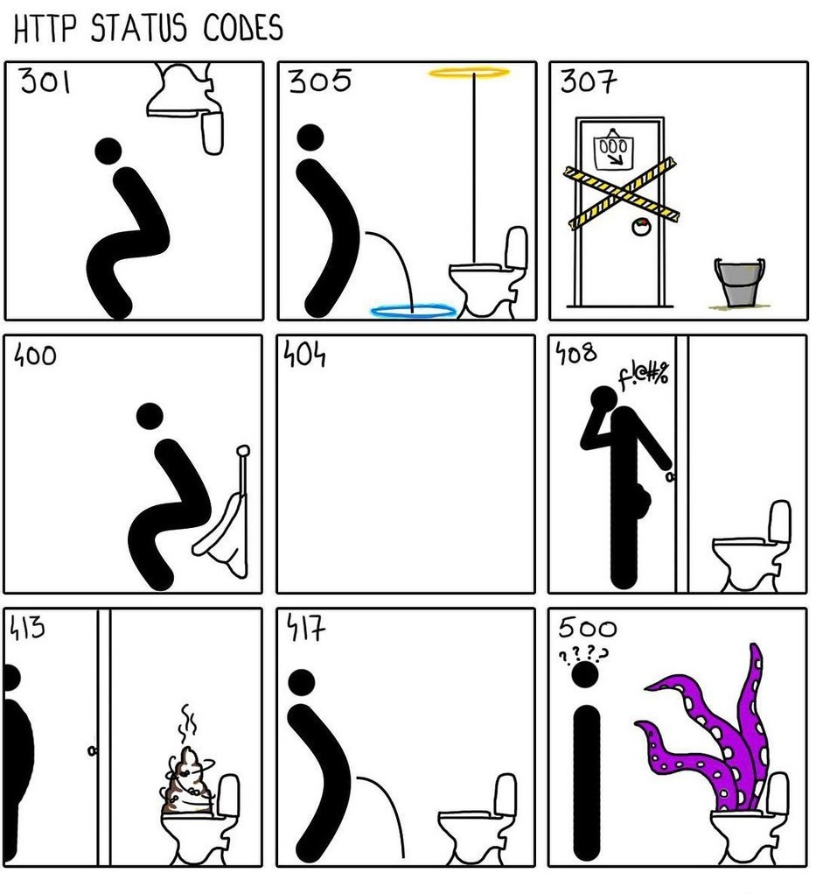

# HTTP

**HTTP** - Hyper Text Transfer Protocol - протокол передачи гипертекста.

Первоначально при разработке протокола планировалось, что по нему будет передаваться только гипертекст в формате HTML, но в настоящее время он используется для передачи любых данных.

Передача данных в HTTP основана на модели клиент-сервер.

Клиент отправляет на сервер запрос - request, а обратно возвращается ответ - response.

В случае, если в ответ на запрос вернулся HTML документ, в котором содержатся ссылки на какие-то документы, необходимые для отображения страницы, например, .css или картинки, то браузер самостоятельно направит еще несколько get запросов, чтобы подтянуть недостающие данные.

---
## Структура протокола

Каждое сообщение протокола HTTP состоит из 3 частей:

- Стартовая строка - определяет тип сообщения (метод)
- Заголовки - характеризуют тело сообщения, параметры передачи и др.
- Тело сообщения - данные сообщения. Отделяются от заголовков пустой строкой. Тело может быть как текстовым, так и бинарным

Стартовая строка запроса содержит:
- метод HTTP
- [URI](../web/uri.md)
- версию протокола

Пример запроса (здесь лучше бы подошел GET, но для того, чтобы показать тело запроса выбран `POST`):
```http
POST /recruits HTTP/1.1
Host: stronghold.org
Accept: application/json
Content-Type: application/json
User-Agent: Mozilla/5.0

[ "hobgoblin", "behemoth" ]
```

Стартовая строка ответа содержит:
- версию протокола
- код ответа
- пояснение к коду

Пример ответа:
```http
HTTP/1.1 200 OK
Content-Type: application/json

{
  "hobgoblin": 5,
  "behemoth": 2
}
```

---
## Методы HTTP:

- `GET` - получить. Одинаковые get-запросы должны возвращать одинаковые ответы
```
GET /path/resource?param1=value1&param2=value2 HTTP/1.1
```

- `PUT` - заменить ресурс.
- `POST` - создать ресурс. Иногда используется для изменения, удаления или для сложного поиска.
- `DELETE` - удалить ресурс.
- `PATCH` - изменить свойство ресурса. В теле запроса отправляется только идентификатор ресурса и изменяемые свойства.
- `OPTIONS` - сервер возвращает список допустимых методов
- `HEAD` - аналог GET, но без тела. Используется для извлечения метаданных
- `TRACE` - запрашивает источник request-а, для того чтобы клиент мог отследить что происходит на другом конце. Используется для тестирования и исправления ошибок.
- `CONNECT` -
- `RETURN` -

Для реализации CRUD достаточно всего 2 методов: GET и POST

Интересно, что протокол HTTP не накладывает ограничений на методы.
Т.е. при желании можно создать свой метод, главное научить работать с ним свои HTTP серверы и клиенты.

---
## Заголовки:

- `Content-Type` - содержит информацию в каком виде представлено тело запроса или ответа. 
  Может быть HTML, XML, JSON или что-нибудь еще. 
  Тип контента записывается с помощью [MIME][mime_note]-типов.
- `Accept` - в каком формате клиент готов принять ответ. 
  Тип контента записывается с помощью [MIME][mime_note]-типов.
- `User-Agent` - информация о клиенте, с которого был отправлен HTTP-запрос. 
  Обычно здесь написана версия браузера. 
  Веб-приложения обычно используют данные из этого заголовка, чтобы подстроить верстку под указанный браузер.
- `Host` - Указывается хост, на который отправляется запрос. 
  Заголовок обязателен, начиная с версии HTTP/1.1. 
  Сделано это из-за того, что при отправке запроса затирается DNS имя, а на одном белом IP-адресе может сидеть несколько http-серверов. 
  В URI же хост может быть не указан
- [`Cookie`](../web/cookie.md) - информация, которая хранится в браузере и обычно используется для идентификации пользователя. 
  Чаще всего используется для обеспечения сессий.
- `Status` - содержит код статуса выполнения запроса, который обозначается тремя цифрами. См. ниже
- `Date`
- `Cache-Control` - контролирует кэширование данных на стороне клиента. 
  Работает только для GET и HEAD запросов. 
  Содержит в себе несколько параметров, регулирующих протухание кэша.
  Используется в основном в браузерах для доступа к статической информации.
  Для корректного функционирования заголовок должен присутствовать и в запросе, и в ответе.

При создании собственного заголовка принято в название добавлять префикс `X-`.
Например: `X-Agent-Id`

---
## Статусы

В стартовой строке ответа сервера содержится код состояния - целое число из 3 цифр:

- 1хх - информационный (зачастую используется в WebSocket)
- 2хх - успех. Пример: 200 - все хорошо
- 3хх - перенаправление (Редирект)
- 4хх - ошибка клиента. Пример: 404 - страница не найдена
- 5хх - ошибка сервера.



Полный перечень ошибок можно найти на [Wiki](https://en.wikipedia.org/wiki/List_of_HTTP_status_codes).


---
## Версии HTTP
- HTTP/0.9 (1991 г.) - существует только метод GET
- HTTP/1.0 (1996 г.) - добавилась вся основная функциональность
- HTTP/1.1 (1999 г.) - стало обязательным в каждый запрос добавлять заголовок `Host`. Используется большинством приложений по состоянию на 2022 г.
- HTTP/2 (2015 г.) - стал бинарным, появились push-уведомления от сервера
- HTTP/3 (2022 г.) - транспорт теперь UDP вместо [TCP](tcp.md)

HTTP/2 был пролоббирован Google для того, чтобы стандартизовать gRPC.

Метод PATCH был включен в ряд стандартных методов HTTP отдельным стандартом в 2010 г. Поэтому некоторые старые инструменты, например стандартная библиотека Java (до появления отдельного HTTP API), не поддерживает его.

---
## HTTPS
HTTPS - это HTTP, в котором все зашифровано с помощью TLS.
Из-за того что шифруется даже заголовок `Host`, снова всплывает проблема с виртуальным хостингом, когда на одном IP может находиться несколько веб-сервисов.
Из-за этого на одном IP может быть только один веб-сервис, использующий HTTPS.

Для решения этой проблемы используется **SNI** - Server Name Indication.
С помощью SNI клиент передает серверу имя хоста во время рукопожатия.
В результате имя хоста становится доступным для перехвата злоумышленниками.

Вопрос: 
> Ну и что, что мы палим имя хоста? Мы же все равно его спалим при обращении к DNS-серверу.

---
## HTTP клиенты

В Java для отправки запросов по HTTP-протоколу используются различные механизмы. Часть из них относится к стандартным средствам языка, а часть является сторонними библиотеками:

- пакет `java.net`, существующий в Java с версии 1.1 с его классами `HttpURLConnection` и пр.
- HTTP API, появившийся в Java 9;
- [Apache Http Client](../external_lib/apache_http_client.md) - дедушка всех http-клиентов.
- Unirest Http API - надстройка над Apache Http Client с упрощенным API
- OkHttp
- Spring RestTemplates - синхронный HTTP клиент. Считается устаревшим
- [Spring WebClient](../spring/web_client.md) - асинхронный HTTP клиент, подходящий для реактивных приложений
- Spring RestClient - синхронный HTTP клиент
- Spring Cloud OpenFeign - декларативный клиент, использующий кодогенерацию

---
## К изучению:

- [X] Стандарт [RFC-2616](https://datatracker.ietf.org/doc/html/rfc2616) на HTTP/1.1
- [X] [Просто о HTTP](https://habr.com/ru/post/215117/) на Хабре
- [X] О [HTTP на Вики](https://ru.wikipedia.org/wiki/HTTP)
- [X] [Wiki. Заголовки HTTP](https://en.wikipedia.org/wiki/List_of_HTTP_header_fields)
- [X] [Пример простого HTTP сервера на Java](https://habr.com/ru/post/441150/)
- [X] [HTTP-клиенты для Java](https://www.reddit.com/r/java/comments/6ixhqe/recommendations_for_java_http_client_libraries/)
- [X] [Объяснение разницы между PUT, POST и PATCH](https://stackoverflow.com/questions/31089221/what-is-the-difference-between-put-post-and-patch)
- [X] [Wiki. HTTPS](https://ru.wikipedia.org/wiki/HTTPS)
- [X] [Wiki. SNI](https://ru.wikipedia.org/wiki/Server_Name_Indication)
- [X] [RFC-5789](https://www.rfc-editor.org/rfc/rfc5789.html), добавляющий метод PATCH
- [X] [Список всех методов HTTP](https://www.iana.org/assignments/http-methods/http-methods.xhtml)


[mime_note]: ../web/mime.md