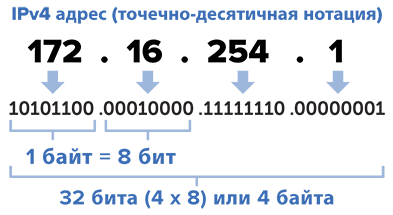

**IP** - Internet Protocol Address - уникальный сетевой адрес
IP состоит из 4 чисел от 0 до 255, разделенных между собой точками

Четырех байт на сегодняшний день уже стало не хватать, поэтому вводится новый формат с 16 байтами - IPv6

IP-адреса делятся на 2 типа:

- локальные (серые)
- глобальные (белые)

### Локальные IP-адреса

Локальные IP-адреса используются внутри локальной сети. Обычно локальные IP-адреса находятся в одном из следующих диапазонов:

- от 10.0.0.0 до 10.255.255.255
- от 172.16.0.0 до 172.31.255.255 - используется обычно интернет-провайдерами для выдачи клиентам, чтобы сэкономить глобальные ip-адреса.
- от 192.168.0.0 до 192.168.1.255 - используются обычно для домашней сети

Все вышеперечисленные IP-адреса зарезервированы для локальных сетей и не могут использоваться в глобальных сетях.

### Глобальные IP-адреса

Глобальные IP-адреса используются в сети Интернет. Глобальный IP-адрес присваивается устройству провайдером интернета.

Узнать глобальный IP своего компьютера (и соответственно всего роутера) можно с помощью сайта https://2ip.ru/

Из-за того что глобальных IP-адресов стало не хватать, интернет-провайдеры начали выдавать клиентам серые IP-адреса, таким образом у нескольких людей в подъезде / доме / квартале может быть одинаковый глобальный IP-адрес.

Для того чтобы поднять на своем компьютере сервер, необходимо иметь белый IP. Получение белого IP-адреса обычно является дополнительной услугой у интернет-провайдеров.

---
## ICMP

ICMP - Internet Control Message Protocol - это протокол сетевого уровня, использующийся для передачи сообщений об ошибках, возникших при посылке IP-пакета.

Примеры ошибок:
- Превышено максимальное количество маршрутизаций (по дефолту 64, максимум - 255)
- Не найден адресат
- Превышен размер пакета (по кабелю Ethernet позволяет в кадре отправить 1500 байт, а по wi-fi - 2305)

Также ICMP используется для информационных сообщений.
Например, именно он используется утилитой _ping_.

---
## NAT - Network Address Translation

NAT - это механизм преобразования ip-адресов, который нужен для того чтобы преобразовывать локальные ip-адреса в глобальные при отправке запроса и наоборот при получении ответа на запрос.

NAT встроен во все роутеры. Благодаря ему ответы на запросы, отправленные с компьютера, приходят на компьютер, а запросы, отправленные с телефона, - на телефон, хотя глобальный IP-адрес у обоих устройств был одинаковым.

---
## DHCP-сервер

Для того чтобы устройство, подключенное к локальной сети не задумывалось о том, какой локальный IP-адрес у него должен быть, существует DHCP-сервер.

DHCP-сервер автоматически раздает IP-адреса подключаемым устройствам.

DHCP-сервер есть в каждом роутере. При перезагрузке роутера все локальные IP-адреса будут перераспределены.

Для того чтобы у устройства не менялся локальный IP-адрес при перезапуске DHCP-сервера необходимо задать ему статический IP.

---
## DNS

Чтобы было удобнее подключаться к сайтам была введена **DNS** - Domain Name System, позволяющая подключаться к компьютерам в сети, используя символьную строку вместо IP.

Домены подразделяются на уровни.
Домен 1 уровня называется доменом верхнего уровня или доменной зоной.

---
## Сетевые устройства

**Роутер** - это устройство, раздающее по устройствам интернет, полученный от провайдера.

Роутер, маршрутизатор и сетевой шлюз - это одно и то же.

**Коммутатор** - устройство для разветвления локальной сети.
Коммутатор и свитч - это одно и то же.

При получении данных коммутатор определяет кому адресовано сообщение и отправляет его нужному устройству.

**Хаб** - служит для того же, что и коммутатор, но основан на другой технологии.

При получении данных хаб отправляет ее всем устройствам, подключенным к нему. Устройства сами должны понять кому именно предназначалась информация.

---
## Транспортные протоколы
Для передачи данных в интернете используются различные транспортные протоколы:

- [TCP](tcp.md) - гарантирует доставку данных и их целостность.
- UDP - не гарантирует целостность данных, но обеспечивает быстродействие.

UDP используется, когда отсутствие задержек в передаче данных важнее их целостности. Например в аудио и видеоконференциях.

TCP используется во всех остальных случаях.

---
## К изучению

- [X] Видео про развитие Web:  https://www.youtube.com/watch?v=ZuzcHSjSLnM (немного не в тему для данной заметки, но больше некуда было положить)
- [X] Введение в сети:  https://habr.com/ru/post/491540/
- [ ] Книга по сетям: https://linkmeup.gitbook.io/sdsm/