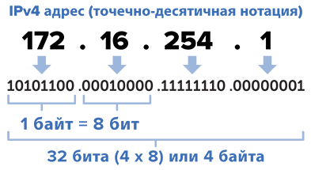

# IP address

__IP address__ - Internet Protocol Address - уникальный сетевой адрес.

IP адрес имеет фиксированную длину в 4 байта.
Наиболее распространенная форма представления IP адреса это 4 числа от 0 до 255, разделенных между собой точками:


Четырех байт на сегодняшний день уже стало не хватать, поэтому в новой версии протокола IPv6 вводится формат с 16 байтами.

IP адрес делится на две части: номер подсети и номер узла в этой подсети.
При этом граница между этими частями не фиксирована и плавает в зависимости от размера подсети.
Например, у оффлайн магазина электроники в подсети может быть не очень большое количество устройств: камеры, сервера, терминалы сотрудников.
И под номер узла в сети хватило бы одного байта.
А у крупного университета могут быть тысячи и десятки тысяч устройств в сети, поэтому ему требовалось бы больше бит на номер устройства в подсети.
За разделение номера подсети и номера узла в подсети отвечает маска подсети.

__Маска подсети__ - это тоже 4 байта информации, состоящие из группы непрерывных единиц и группы непрерывных нулей, граница между которыми разделяет номер подсети и номер узла подсети в IP-адресе.
```
# бинарный вид
11111111 11111111 11111111 00000000
                          ^
                    граница между подсетью и узлом

# человекочитаемый вид
255.255.255.0
```

Для маски выше в IP адресе `192.168.2.1` первые 3 байта отвечали бы за номер подсети - `192.168.2`, а последний байт - `1` за номер устройства в подсети.

Иногда при обозначении IP адреса указывают количество бит, отведенных под номер подсети, через слеш после IP-адреса:
```
127.0.0.1/8 - 8 бит под номер сети
```

Маски оказались слишком гибкими, поэтому в итоге интернет сообщество решило просто разделить все IP-адреса на 5 классов.

## Классы IP адресов

| Класс | Первые биты | Наименьший номер подсети | Наибольший номер подсети | nodes max count |
|---|---|---|---|---|
| A | 0     | 1.0.0.0   | 126.0.0.0       | 2^24 |
| B | 10    | 128.0.0.0 | 191.255.0.0     | 2^16 |
| C | 110   | 192.0.0.0 | 233.255.255.0   | 2^8  |
| D | 1110  | 240.0.0.0 | 247.255.255.255 |  |
| E | 11110 | 240.0.0.0 | 247.255.255.255 |  |

Классы
- A, B, C - индивидуальные адреса (unicast address)
- D - групповые адреса - в них нет разделения на подсети и узлы. К одному групповому IP-адресу могут быть подключено множество узлов. Это используется для широковещательной передаче данных, например, для трансляции футбольных матчей.
- E - зарезервировано на будущее


## Особые IP адреса

Узел не может получить номер состоящих из одних единиц или из одних нулей.
Такие номера являются зарезервированными.
Если узел отправляет IP-пакет, указав в качестве получателя IP-адрес с номером узла из одних нулей (например, `192.168.2.0`), то это будет воспринято маршрутизатором, что узел отправил пакет сам себе.
Если узел отправляет IP-пакет, указав в качестве получателя IP-адрес с номером узла из одних единиц (например, `192.168.2.255`), то это будет воспринято маршрутизатором, что узел отправил пакет всем устройствам в подсети.

Особенное значение имеют IP адреса, начинающиеся с `127`.
Такие IP-адреса используются в пределах одного компьютера для связи приложений между собой, а также для локальной отладки и тестирования.
Сообщения с таким IP адресом в поле получателя не отправляются в сеть.

Также для организации __интранетов__ зарезервированы следующие подсети:
- `10.0.0.0` - в классе A. Например, в компании, в которой я работал, для внутренней сети использовались IP адреса именно этой подсети
- `172.16.0.0 - 172.31.0.0` - в классе B. Используются обычно интернет-провайдерами для выдачи клиентам, чтобы сэкономить глобальные ip-адреса.
- `192.168.0.0 - 192.168.255.0` - в классе C. Как правило, домашние маршрутизаторы создают подсети именно в этих группах. Например, моя домашняя подсеть имеет IP адрес `192.168.2.0`.

Выделение групп адресов под интранет позволяет не бояться, что при подключении интранета к интернету IP-адреса внутренних устройств начнут конфликтовать с IP-адресами внешних ресурсов.


---
## Назначение IP адресов

IP адреса, входящие в интранет, еще называют __серыми__.
А глобальные IP адреса, использующиеся в общем интернете, называют __белыми__.

Распределением белых IP адресов занимается некоммерческая организация __ICANN__ - Internet Corporation for Assigned Names and Numbers и ее департамент __IANA__ - Internet Assigned Numbers Authority.
Она распределяет номера сетей между другими некоммерческими организациями, прикрепленными к определенным географическим областям.
А те, в свою очередь распределяют сетевые адреса между крупными компаниями и провайдерами связи.

Например, компании Билайн организация RIPE NCC [выделила](https://2ip.ru/as/12543/) IP-адреса в диапазонах `94.138.0.0 - 94.138.31.255`, `213.132.64.0 - 213.132.67.255` (на самом деле больше, т.к. у Билайна много дочерних компаний, на каждую из которых зарегистрированы свои адреса).

Сейчас в мире наблюдается дефицит глобальных IP-адресов.
Отчасти это связано с тем, что год от года количество устройств, подключаемых к интернету, растет.
Но также есть проблема с нерациональным распределением существующих IP-адресов.

Из-за того что глобальных IP-адресов стало не хватать, интернет-провайдеры начали выдавать клиентам серые IP-адреса, таким образом у нескольких людей в подъезде / доме / квартале может быть одинаковый глобальный IP-адрес.

Для того чтобы поднять на своем компьютере сервер, подключенный к интернету, необходимо иметь белый IP. 
Получение белого IP-адреса обычно является дополнительной услугой у интернет-провайдеров.


## Работа с IP адресами

Чтобы узнать IP адрес своего устройства нужно набрать в терминале команду:
```shell
# Windows
ipconfig

# Linux, Mac
ifconfig
# или еще в Linux
ip addr
```

Такая команда покажет несколько блоков по каждой сети, в которую входит ваше устройство.

Узнать глобальный IP адрес, с которого вы выходите в интернет, можно с помощью сайта https://2ip.ru/.


---
## К изучению

- [X] Книга "Компьютерные сети". Олифер В., Олифер Н. Часть 4 - Сети TCP/IP.
