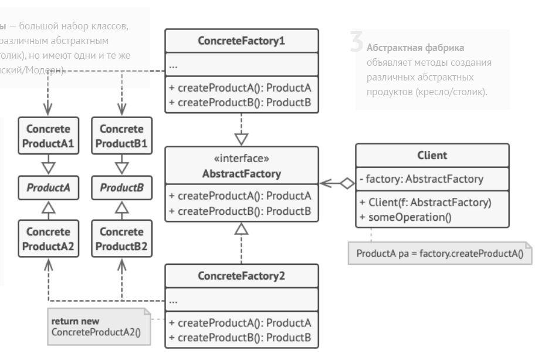

Паттерн Абстрактная фабрика предоставляет интерфейс создания семейств взаимосвязанных или взаимозависимых объектов без указания их конкретных классов.

### Реализация

Для генерации множества модельных объектов (зачастую используемых совместно), каждый из которых имеет несколько подтипов, создается абстрактный класс, предоставляющий абстрактные методы генерации, возвращающие интерфейсы. Каждая реализация абстрактной фабрики переопределяет все методы генерации и возвращает в них конкретные объекты.

Клиентский код для создания необходимых типов моделей должен использовать конкретную реализацию фабрики.

По сути каждый метод генерации в абстрактной фабрике является [фабричным методом](factory_method.md).

Разница между фабричным методом и абстрактной фабрикой заключается в том, что фабричный метод использует наследование, а абстрактная фабрика - композицию.

### Случаи использования

Абстрактная фабрика позволяет соблюсти принцип инверсии зависимостей, абстрагируя работу высокоуровневых компонентов, т.к. они начинают работать с интерфейсами, а не с конкретными реализациями.

### Примеры из стандартной библиотеки

-

---
## К изучению
- [X] HeadFirst. Паттерны проектирования. Глава 4
- [X] Refactoring Guru: https://refactoring.guru/ru/design-patterns/abstract-factory