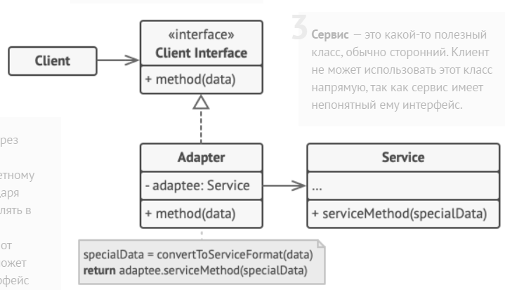

Паттерн Адаптер используется для того, чтобы совместить два различных интерфейса.

Адаптер обеспечивает совместную работу классов, невозможную в обычных условиях из-за несовместимости интерфейсов.

### Реализация

Существует 2 способа создания адаптера:
- Через наследование - адаптер наследует нужный класс и имплементирует интерфейс. В реализации методов интерфейса вызываются методы родительского класса.
```java
class Adapter extends MyClass implemets MyInterface{
    public void interfaceMethod1(){
        classMethod1();
    }
    //и так по каждому методу
}
```

Такой способ отстойный, потому что композиция намного более гибкая связь, чем наследование. К тому же зачастую адаптером нужно связывать два интерфейса или класс с классом, в таком случае создать адаптер построенный на наследовании просто невозможно.

- Через композицию - адаптер имплементирует один интерфейс и имеет поле в виде объекта другого интерфейса/класса. При этом создается конструктор, в котором поле должно инициализироваться (необязательно, если поле будет инициализироваться сразу). В реализации методов интерфейса вызываются методы внутреннего объекта.

```java
class Adapter implements Interface2{
    private Interface1 object;
    Adapter(Interface1 object){
        this.object = object;
    }
    //Методы Interface2, которые вызывают методы Interface1
}
```



### Случаи использования

Адаптер используется в тех случаях, когда два существующих объекта должны использовать один другой, но это не получается сделать из-за отличия в предоставляемых API.

Адаптеры бывают не только на уровне классов, но и на уровне целых систем, правда в таких случаях адаптеры представляют собой не один класс, а целый модуль или даже отдельный сервис.

### Взаимоотношения с другими паттернами

Хотя и Адаптер и Декоратор инкапсулируют в себе некоторый объект, они отличаются тем, что Адаптер приводит инкаспулируемый объект к другому интерфейсу, не прибавляя никакого поведения, Декоратор же напротив добавляет поведение, но при этом не изменяет интерфейс обернутого объекта.

### Примеры

- Вся библиотека Jackson может считаться адаптером между json-строками и объектами
- Любой JDBC драйвер является адаптером между СУБД и java-кодом

---
## К изучению
- [X] HeadFirst. Паттерны проектирования. Глава 7
- [X] Статья на Refactoring Guru: https://refactoring.guru/ru/design-patterns/adapter
- [ ] https://habr.com/ru/post/85095/