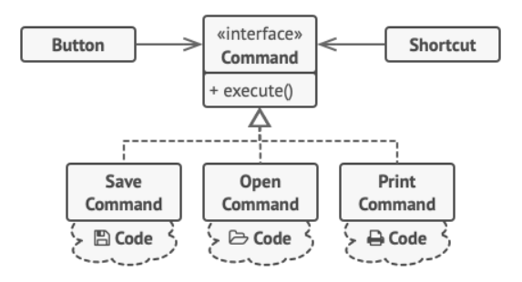

Паттерн Команда инкапсулирует запрос в виде объекта, делая возможной параметризацию клиентских объектов с другими запросами, организацию очереди или регистрацию запросов, а также поддержку отмены операций.

### Реализация

Создается интерфейс команды, в котором объявлен метод, выполняющий некоторые действия - `execute()`. Дополнительно могут быть объявлены метод, откатывающий изменения `undo()`, метод `store()` для сохранения информации о применении команды, и метод `load()` для . Последние два метода обычно применяются для восстановления после сбоев.

Каждая реализация интерфейса по своему реализует эти методы.

Класс-инициатор содержит в себе объект команды или список командных объектов, что позволяет в рантайме менять исполняемый код.

Установкой конкретной команды в класс-инициатор занимается клиентский класс.

### Случаи использования

Паттерн часто используется в пользовательских интерфейсах, позволяя гибко настраивать пользователю интерфейс под себя.

Помимо этого паттерн используется для реализации очередей выполняемый действий.

Также паттерн может использоваться для предоставления возможности пользователю создавать макросы.

В тех случаях, когда нужно передать отсутствие каких-либо действий, можно воспользоваться паттерном [Null Object](null_object.md), создав команду `EmptyCommand` с пустой реализацией всех методов.

Если команда используется только в одном месте, то зачастую она может быть заменена на лямбда-выражение.

### Примеры из стандартной библиотеки

- `Runnable` является самым показательным примером команды.
- Для пулов тредов интерфейс `Callable` является командным интерфейсом.
- В транзакциях каждое действие над базой является командой, которую можно откатить.

---
## К изучению
- [X] HeadFirst. Паттерны проектирования. Глава 6
- [X] Refactoring Guru: https://refactoring.guru/ru/design-patterns/command