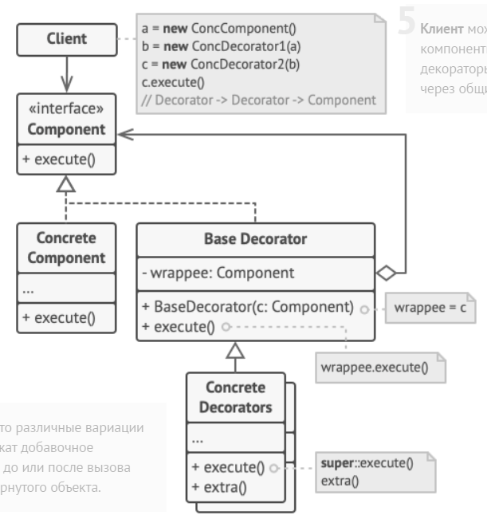

Паттерн декоратор позволяет динамически наделять объект новыми возможностями.

### Реализация

Для того чтобы создать класс-обертку необходимо:
- Унаследовать класс / интерфейс декоратора от декорируемого класса.
- Создать конкретные классы декоратора, унаследовав их от базового декоратора (обычно это абстрактный класс или интерфейс). Внутри конкретных классов завести поле, в котором хранится декорируемый объект.
- Создать методы генерации обертки (конструктор / фабричный метод), принимающие в качестве аргументов объект декорируемого класса.
- Переопределить методы, поведение который требуется изменить.
- Делегировать выполнение остальных методов обернутому объекту.
- Дополнить поведение при необходимости.

### Взаимоотношения с другими паттернами

- [Паттерн Компоновщик](composite.md). И тот, и другой паттерн позволяют реализовать рекурсивную вложенность. Но декоратор обертывает только один объект, а компоновщик обертывает сразу несколько объектов.

### Примеры из стандартной библиотеки

- Классы из пакета java.io. InputStream - абстрактный класс, наследники которого могут оборачиваться в декораторов. FilterInputStream - абстрактный класс декоратора, наследники которого могут оборачивать декорируемый компонент.
- Существуют классы-обертки для всех примитивных типов: Integer, Character, Byte, Double и т.д. Но их вряд ли можно назвать декораторами.

---
## К изучению
- [X] HeadFirst. Паттерны проектирования. Глава 3
- [X] Refactoring Guru: https://refactoring.guru/ru/design-patterns/decorator