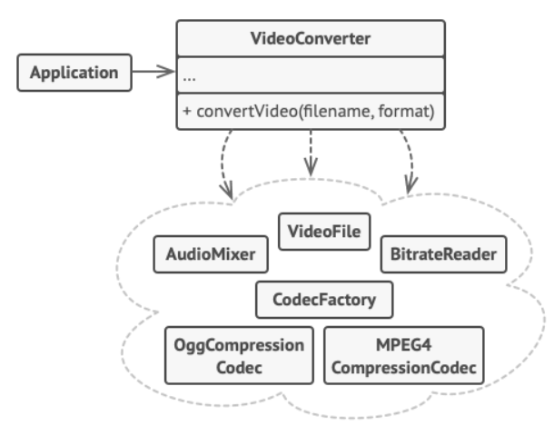

Паттерн Фасад предоставляет унифицированный интерфейс к группе интерфейсов подсистемы. Фасад определяет высокоуровневый интерфейс, упрощающий работу с подсистемой.

### Реализация

Реализация Фасада весьма примитивна:

- Создать интерфейс с желаемыми методами
- Создать класс и реализовать этот интерфейс
- Инкапсулировать в классе те объекты, интерфейсы которых нам не нравятся.
- Переопределить методы нашего интерфейса так, чтобы они использовали инкапсулированные объекты.

### Случаи использования

Фасад используется в тех случаях, когда хочется оградиться от излишне сложного интерфейса используемых библиотек, оставив только ту часть функционала, которая нужна для разрабатываемой системы.

Также фасад может использоваться для того, чтобы создать общий интерфейс для классов, которые отвечают за обработку одной сущности, но делают это в интересах различных клиентов. Таким образом соблюдается принцип единственной ответственности (SRP) из [Принципы SOLID](evernote:///view/170585988/s440/9decc247-e39c-d9cf-b32c-b845d8f9fa8c/48961e8e-4a2c-4d01-818a-19d7bfdff159/).

### Взаимоотношения с другими паттернами

- [Паттерн Декоратор](decorator.md). И тот и другой паттерн подразумевают создание класса, инкапсулирующего в себе другой объект. Но декоратор не меняет его интерфейс, изменяя / дополняя поведение. Фасад же напротив: не меняет поведение, но изменяет интерфейс.
- [Паттерн Адаптер](adapter.md). Если адаптер используется для совмещения неподходящих интерфейсов, то фасад сам формирует удобный для пользователей интерфейс.

### Примеры

- В библиотеке Spring Email класс `MailMessageHelper` является фасадом для множества классов из библиотеки Jakara Mail.
- Многие Spring аннотации являются фасадом для других аннотаций.
- Лично я писал фасад для работы с библиотекой `libphonenumber`, упрощающий работу с российскими телефонными номерами.
- Также я писал фасад для работы с электронными письмами, как оказалось - зря, потому что подобный фасад есть в Spring Email.

---
## К изучению
- [X] HeadFirst. Паттерны проектирования. Глава 7
- [X] Статья на Refactoring Guru: https://refactoring.guru/ru/design-patterns/facade