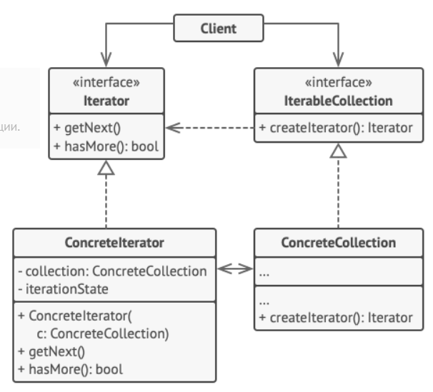

Паттерн Итератор предоставляет механизм последовательного перебора элементов коллекции без раскрытия ее внутреннего представления.

### Реализация
- Создается интерфейс, позволяющий перебирать элементы коллекций. В стандартной библиотеке Java уже существует такой интерфейс - `Iterator`.
- Создается конкретная реализация этого интерфейса, которая позволяет перебрать элементы конкретной коллекции.
- Коллекция реализует интерфейс `Iterable`, в котором есть фабричный метод генерации итератора `iterator()`.
- Реализуется метод `iterator()`, возвращая нужную реализацию итератора.
- Теперь любой клиентский код может создать итератор и перебрать элементы коллекции, не догадываясь о внутренней реализации этой коллекции.



Опционально: можно создать фабричный метод, который будет генерировать итераторы, обходящие коллекцию различными способами.

### Случаи использования

Паттерн настолько прочно вплетен в стандартную библиотеку Java, что, кажется, не существует таких ситуаций, когда его нужно будет реализовывать самостоятельно.

Для обхода элементов коллекции, реализующей `Iterable`, создана даже специальная синтаксическая конструкция - `foreach`:
```java
for(Unit unit: units) {
    //...
}
```

### Взаимоотношения с другими паттернами
- [Паттерн Компоновщик](composite.md) часто использует итератор для обхода по инкапсулированной группе объектов.
- [Паттерн Фабричный метод](factory_method.md) используется для генерации конкретной реализации итератора в классе коллекции.

### Примеры
- Все коллекции из стандартной библиотеки

---
## К изучению
- [X] HeadFirst. Паттерны проектирования. Глава 9
- [X] Статья на Refactoring Guru: https://refactoring.guru/ru/design-patterns/iterator