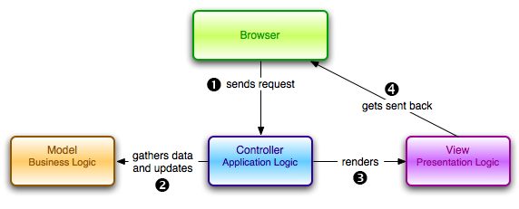

**MVC** - Model-Veiw-Controller

Данный паттерн относится к архитектуре ПО. Он разбивает программу на три большие части:

1. Model - объект, который содержит в себе данные, и бизнес-логику. Также модель обычно занимается работой с базой данных
2. View - занимается отображением информации
3. Controller - получает запрос от клиента, оповещает об этом модель, обновляет view

Основная задача MVC - изолировать внешний вид от бизнес-логики.

Задача программиста - сделать контроллер как можно проще, т.е. в нем не должно быть никакой логики кроме передачи данных от одного объекта к другому.

Существуют различные представления MVC:
- Model полностью изолирована от View
- Model может передавать данные в View, но View не может влиять на модель.

View может выдавать различное представление:
- в веб-технологиях - html-странички
- в случае standalone ПО - GUI на основе, к примеру, Swing
- или даже консольный вывод

---
## К изучению
- [X] Видео от учеников JavaRush: https://www.youtube.com/watch?v=FISFT6cFUAs
- [X] На английском (4 минуты): https://www.youtube.com/watch?v=DUg2SWWK18I&feature=youtu.be