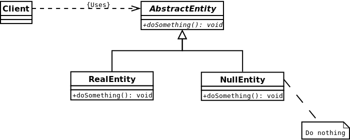

Для того чтобы бороться с `NullPointerException` было придумано вместо null, присваивать объектам реализацию абстрактного класса, которая ничего не делает.

Значащие объекты тоже должны быть унаследованы от этого абстрактного класса.

К ознакомлению:
- [ ] https://ru.wikipedia.org/wiki/Null_object_(%D1%88%D0%B0%D0%B1%D0%BB%D0%BE%D0%BD_%D0%BF%D1%80%D0%BE%D0%B5%D0%BA%D1%82%D0%B8%D1%80%D0%BE%D0%B2%D0%B0%D0%BD%D0%B8%D1%8F) 
- [ ] https://habr.com/ru/post/309462/