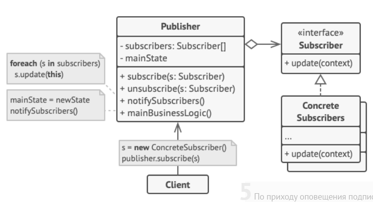

### Формальное определение

Паттерн Наблюдатель определяет отношение "один-ко-многим" между объектами таким образом, что при изменении состояния одного объекта происходит автоматическое оповещение и обновление всех зависимых объектов.

### Реализация

Субъект наблюдения должен иметь список наблюдателей, а также обладать возможностью регистрировать новых наблюдателей и удалять из рассылки старых.

Все наблюдатели должны реализовывать общий интерфейс с методом `update()`, чтобы субъект наблюдения мог оповещать их об изменениях.

В наблюдателе необязательно создавать поле со ссылкой на субъект наблюдения. Делать это нужно, только если требуется иметь возможность отписаться от субъекта самим наблюдателем.

### Случаи использования

Паттерн Наблюдатель используется в тех случаях, когда необходимо оповещать о наступлении каких-либо событий или об изменениях в состоянии субъекта наблюдения множество различных потребителей. Зачастую это требуется при работе с UI, но может также использоваться для оповещения при помощи электронной почты (или других каналов связи) при наступлении каких-либо событий.

### Примеры из стандартной библиотеки

- в пакете `java.util` существует интерфейс `Observer` и класс `Observable`, которые представляют собой стандартную реализацию паттерна Наблюдатель. В реальности ими пользуются редко из-за непродуманного API. В первую очередь из-за того, что `Observable` - неабстрактный класс, от которого необходимо унаследоваться (а следовательно лишиться возможности наследоваться от чего-либо еще).

---
## К изучению
- [X] Глава 2 HeadFirst Паттерны проектирования
- [ ] Refactoring Guru: https://refactoring.guru/ru/design-patterns/observer