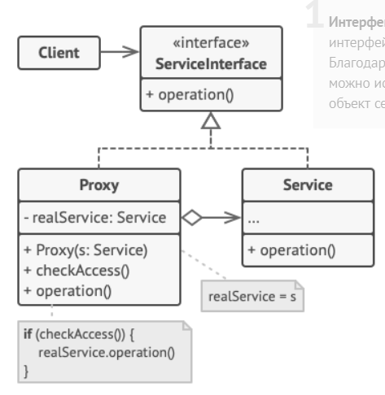

Паттерн заместитель предоставляет суррогатный объект, управляющий доступом к другому объекту.

У данного паттерна есть несколько воплощений, каждое из которых преследует свои цели и реализуется по-разному:

- Удаленный заместитель - предоставляет доступ к удаленному объекту.
- Виртуальный заместитель - управляет доступом к тяжелому ресурсу, создание которого требует больших затрат.
- Защитный заместитель - контролирует доступ к объекту
- Динамический заместитель - позволяет менять поведение определенного класса, создавая его заместителя в рантайме. Такой заместитель называется динамическим, потому что его класс генерируется во время выполнения программы.

### Реализация

- Контракт класса, который мы хотим заменить выносится в интерфейс
- Создается класс-заместитель, реализующий вышеупомянутый интерфейс
- В классе-заместителе заводится поле замещаемого класса
- Методы в классе-заместителе реализуются необходимым образом.

### Взаимоотношения с другими паттернами

- [Паттерн Декоратор](decorator.md) также оборачивает объект, как и виртуальный или защитный заместитель. Но заместители не используются для рекурсивного оборачивания объекта и используются для другой цели.

### Примеры

- Удаленный заместитель реализуется в Java с помощью RMI.
- Виртуальные заместители зачастую используются для кэширования результатов выполнения методов замещаемого объекта.
- Динамический заместитель реализуется с помощью стандартной библиотеки Рефлексии.
- На динамическом заместителе основан IoC-контейнер в Spring (как мне кажется).

---
## К изучению
- [X] HeadFirst. Паттерны проектирования. Глава 11
- [X] Статья на Refactoring Guru: https://refactoring.guru/ru/design-patterns/state