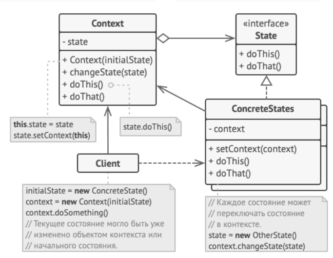

Паттерн Состояние управляет изменением поведения объекта при изменении его внутреннего состояния. Внешне это выглядит так, словно объект меняет свой класс.

### Реализация

- Создается интерфейс состояния, в котором объявляются методы, которые имеют различие в бизнес-логике для различных состояний.
- Интерфейс реализуется конкретными классами, каждый из которых является определенным состоянием, в котором может находиться объект.
- В классе объекта, который должен иметь несколько состояний, заводится поле созданного интерфейса.
- В тех случаях, когда бизнес-логика объекта должна отличаться в зависимости от состояния объекта, вызываются методы поля состояния.
- Объект может динамически переходить из состояния в состояние, меняя реализацию интерфейса.

### Случаи использования

Для отражения состояния, в котором находится объект, в его классе может быть поле типа перечисления. Но в таком случае, все различия в бизнес-логике для различных состояний требуют большого количества условных операторов или операторов switch. Такой подход затрудняет понимание бизнес-логики и делает код менее поддерживаемым.

Для того чтобы упростить чтение бизнес-логики используется паттерн Состояние.

Некоторые действия для определенных состояний могут не иметь смысла. Поэтому в их реализации могут выбрасываться исключения. Такие методы нарушают принцип подстановки Барбары Лисков ([Принципы SOLID](evernote:///view/170585988/s440/9decc247-e39c-d9cf-b32c-b845d8f9fa8c/48961e8e-4a2c-4d01-818a-19d7bfdff159/)).

### Взаимоотношения с другими паттернами

- [Паттерн Стратегия](strategy.md) очень похож на Состояние. Но Состояние используется для динамического изменения поведения объекта, а Стратегия используется для обретения преимуществ полиморфизма для подклассов, имеющих различную бизнес-логику. И хотя Стратегия также позволяет динамически менять поведение подклассов, обычно поведение устанавливается на этапе компиляции и в дальнейшем не меняется.

### Примеры

- Не видел ни одной реализации, но хочу часто использовать в своем коде, где есть объекты, которые могут переходить из состояния в состояние.

---
## К изучению
- [X] HeadFirst. Паттерны проектирования. Глава 10
- [X] Статья на Refactoring Guru: https://refactoring.guru/ru/design-patterns/state