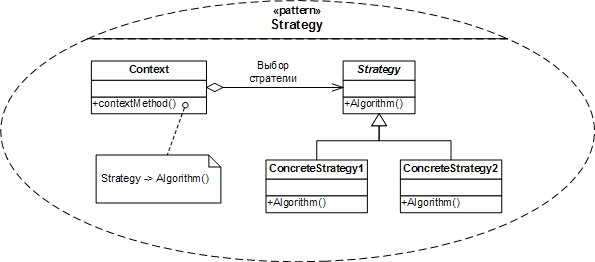

Паттерн стратегия заключается в том, что рекомендуется некоторые методы родительского класса, которые не должны присутствовать в каких-либо реализациях этого абстрактного класса, инкапсулировать в отдельных интерфейсах.

Паттерн Стратегия определяет семейство алгоритмов, инкапсулирует каждый из них и обеспечивает их взаимозаменяемость.

### Реализация

Есть родительский класс с несколькими потомками. Каждый потомок реализует какой-нибудь метод, объявленный у родителя, по-разному.

Для того чтобы не дублировать код при создании новых потомков создается специальный интерфейс с одним методом и несколько классов, реализующих этот интерфейс, и, соответственно этот метод.

В родительском классе заводится поле с типом вновь созданного интерфейса. Присвоение конкретной реализации интерфейса может быть реализовано в конструкторе класса или в методе-сеттере. Тот метод, который раньше приходилось переопределять во всех наследниках, переписывается: теперь в нем просто вызывается метод заведенного поля.

Каждый класс-наследник выбирает нужную ему реализацию интерфейса.

Начиная с Java 8 для передачи поведения вместо различных реализаций интерфейса можно использовать лямбда-выражения.

### Случаи использования

Паттерн стратегия может использоваться для того чтобы заменить большие структуры if и switch, которые задают поведения для различных видов объектов.

Например, если существует enum, по которому делается switch и для каждого значения перечисления задается свое поведение (для каких-то кейсов оно может быть одинаковым). В таком случае это поведение можно задать в различных реализациях интерфейса-стратегии, а в самом перечислении создать поле, хранящее определенную реализацию поведения.

Что делать в Spring-окружении, где все проходит через singleton бины - я пока не знаю.

### Примеры из стандартной библиотеки

- `java.util.Comparator` - является интерфейсом-стратегией. Его метод `compare()` вызывается при сортировке коллекций.
- Наверное все функциональные интерфейсы могут считаться стратегиями, если они записываются в виде поля в вызывающий класс.

---
## К изучению
- [X] JavaRush: https://javarush.ru/groups/posts/2271-pattern-proektirovanija-strategija
- [X] HeadFirst. Паттерны проектирования. Глава 1
- [X] Refactoring Guru: https://refactoring.guru/ru/design-patterns/strategy