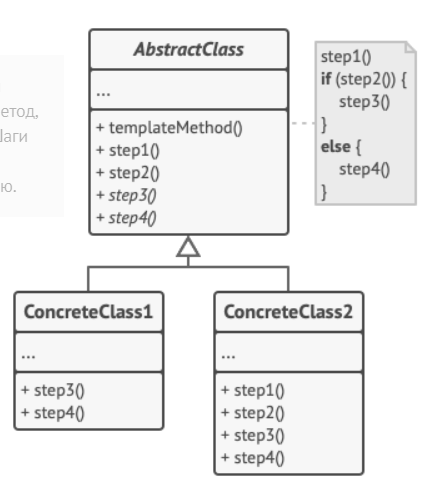

Паттерн Шаблонный метод задает скелет алгоритма в методе, оставляя определение реализации некоторых шагов субклассам. Субклассы могут переопределять некоторые части алгоритма без изменения его структуры.

### Реализация

Реализация достаточно проста:

- Создается абстрактный класс
- Все шаги, реализация которых может отличаться в различных реализациях этого абстрактного класса, объявляются абстрактными методами.
- Создается метод, который поочередно вызывает абстрактные методы.
- Метод объявляется финальным, чтобы его невозможно было переопределить в субклассах.
- При необходимости в абстрактном классе определяются методы с пустой реализацией (или реализацией по умолчанию) - хуки, которые могут реализовываться частью дочерних классов. С помощью хуков можно управлять последовательностью выполнения шаблонного метода.

С появлением дефолтных методов в интерфейсах паттерн Шаблонный метод стало возможным реализовывать с помощью интерфейсов, а не абстрактных классов. Но такой подход плох тем, что дефолтные методы не могут быть финальными, а следовательно их можно переопределить в наследниках.

Хуки нарушают принцип подстановки Барбары Лисков ([Принципы SOLID](evernote:///view/170585988/s440/9decc247-e39c-d9cf-b32c-b845d8f9fa8c/48961e8e-4a2c-4d01-818a-19d7bfdff159/)).

### Случаи использования

Паттерн используется, когда необходимо создать обобщенный каркас для выполнения некоторых действий.

### Взаимоотношения с другими паттернами

- [Паттерн Стратегия](strategy.md). Стратегия лучше тем, что опирается на композицию, тогда как шаблонный метод на наследование, но проигрывает в том, что позволяет задать различие в поведении только отдельных методов, не устанавливая обобщенный порядок их применения.
- [Паттерн Фабричный метод](factory_method.md) зачастую является одним из шагов Шаблонного метода.

### Примеры

- Некоторые методы в `AbstractList`, например `addAll()`.
- Лично я использовал Шаблонный метод в проекте Forward, когда создавал общий компонент для работы с простыми письмами и письмами с CSV-содержимым. Шаблонный метод устанавливал порядок подготовки письма, его отправки и логирования, а различные реализации абстрактного класса

---
## К изучению
- [X] HeadFirst. Паттерны проектирования. Глава 8
- [X] Статья на Refactoring Guru: https://refactoring.guru/ru/design-patterns/template-method