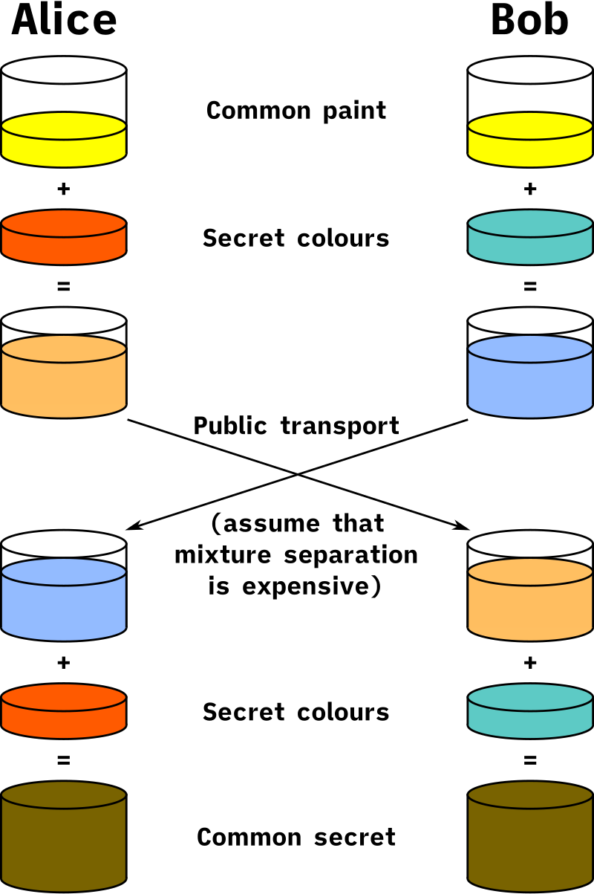

# Протокол Диффи-Хеллмана

Протокол Диффи-Хеллмана позволяет двум акторам сгенерировать общий секретный ключ, не посылая его в явном виде друг другу.

Важно! При обмене данными два актора должны быть уверены, что общаются именно друг с другом.
Иначе man-in-the-middle может перехватить трафик и сформировать с каждым из акторов свой собственный секретный ключ.

### Аналогия

Протокол Диффи-Хеллмана часто объясняют на примере смешивания красок.
Представим, что акторы А и Б хотят выбрать себе секретный цвет.
Они договариваются об общей краске, например _желтой_.
Затем актор А смешивает _желтую_ краску со своей тайной _синей_ краской, о которой он никому ничего не говорит, и получает _зеленую краску_.
Актор Б в это время смешивает _желтую_ краску со своей тайной _красной_ краской, и получает _оранжевую краску_.
Далее, они обмениваются данными о том, какая у кого краска получилась.
После чего замешивают чужую смешанную краску со своей тайной краской.
Актор А смешивает свою тайную _синюю_ краску с _оранжевой_ смесью актора Б и получает _серо-буро-малиновую_ краску.
Актор Б смешивает свою тайную _красную_ краску с _зеленой_ смесью актора А и тоже получает _серо-буро-малиновую_ краску.
Теперь знание о _серо-буро-малиновой_ краске является тайным, и известно только акторам А и Б.

Аналогия не является слишком точной, потому что из данных о том, что общая краска была _желтой_, а в результате смешивания у актора А получилась _зеленая_ краска, можно догадаться, что тайной краской актора А была _синяя_.
В реальном алгоритме так сделать не получится, потому что в нем используются не краски, а натуральные числа, и там существует бесконечное количество вариантов тайных чисел, позволяющих превратить общеизвестное число в конкретное смешанное число.

Также в современном мире узнать какой был второй исходный компонент у составной краски, зная первый компонент, является тривиальной задачей.
А протокол Диффи-Хеллмана основан на том, что обратная операция является очень трудоемкой.

### Алгоритм

Протокол Диффи-Хеллмана использует математический алгоритм, основанный на свойствах натуральных чисел.

1. Актор А выбирает простое число `p` и произвольное число `q`. 
  Также выбирает тайное число `a`.
2. Актор А вычисляет число `A` по формуле `A = ( q ^ a ) mod p` и высылает актору Б тройку чисел `A`, `p`, `q`.
3. Актор Б выбирает тайное число `b`, вычисляет `B = ( q ^ b ) mod p` и высылает актору А получившееся значение `B`.
4. Затем, каждый из акторов рассчитывает `( B ^ a ) mod p` и `( A ^ b ) mod p` на своем тайном числе и получает некий результат.
  По математическим законам акторы получают одинаковый результат.
5. Акторы используют получившееся число в качестве секретного ключа.

---
## Применение

Протокол Диффи-Хеллмана используется:
- в [TLS](../network/tls.md) для формирования сеансового ключа.
- в [SSH](../network/ssh.md) для формирования сеансового ключа.

---
## К изучению

- [X] Книга "Теоретический минимум по Computer Science. Сети, криптография и Data Science". Ф.Ф. Владстон, П. Мото. Глава 3 - Безопасность.
- [X] [Wiki. Diffie-Hellman key exchange](https://en.wikipedia.org/wiki/Diffie%E2%80%93Hellman_key_exchange)
