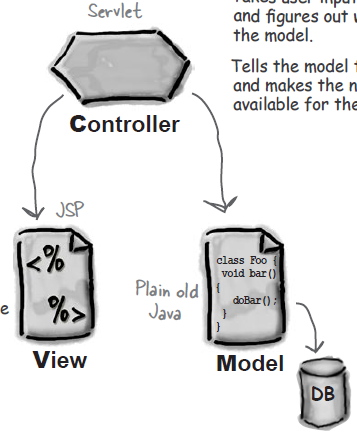

**Сервлеты** - аналог апплетов, но выполняемых на стороне сервера.

Сервлеты обрабатывают http-запросы (request) и возвращают ответы (response).

Один сервлет устанавливает определенный response на группу (или один) пользовательский request.

Все сервлеты являются Singleton-ами

---
## Жизненный цикл сервлета

- Запуск
    - Создание объекта класса сервлета
    - Вывоз метода `init()` сервлета
- Обслуживание запросов
    - Обработка запросов с помощью метода `service()`
- Прекращение работы сервлета
    - Вызов метода `destroy()` на сервлете

Методы `init()` и `destroy()` можно переопределять, чтобы открыть и закрыть необходимые ресурсы. Переопределять метод `service()` строго не рекомендуется.

Сервлет инициализируется с помощью метода `init()`, а не с помощью конструктора, потому что веб-контейнер передает в секретном методе `init(ServletConfig)` данные о контейнере, до вызова метода `init()` без аргументов.

---
## Сервлет-контейнеры
Популярные сервлет-контейнеры:

- [Apache Tomcat](../external_lib/tomcat.md)
- [Jetty](../external_lib/jetty.md)

Сервлет-контейнеры скрывают некоторую логику управления сервлетами, распределения запросов между ними, создания нитей для выполнения запросов и пр.

Каждый запрос к сервлету выполняется сервлет-контейнером в отдельной нити.

---
## `web.xml`

Сервлеты описываются в файле `web.xml`. Этот файл также называют *Deployment Descriptor* - [дескриптор развертывания](deployment_descriptor.md).

---
## Структура сервлета

Сервлет представляет собой обычный класс, который унаследован от класса `HttpServlet`. Класс `HttpServlet` является абстрактным, хотя в нем определены все методы. Сделано это для того, чтобы подчеркнуть, что в классе нет никакой логики обработки запросов - ее нужно написать самостоятельно.

При генерации сервлета с помощью Intellij IDEA в сервлете сразу присутствуют заготовки двух методов:

- `void doGet(request, response)` - устанавливает логику работы сервера при получении GET-запроса. По соглашению между программистами код в методе doGet() должен быть идемпотентным, т.е. не должен ничего менять на сервере.
- `void doPost(request, response)` - устанавливает логику работы сервера при получении POST-запроса

Для того чтобы что-то записать в ответ сервера (response) необходимо получить из объекта response поток записи `PrintWriter`
```java
protected void doGet(... request, ... response){
    PrintWriter writer = response.getWriter();
    writer.println("Vovan - loh!");
}
```

Методы класса `HttpServletRequest`:

- работа с параметрами запроса:
    - `String getParameter(String)` - возвращает от запроса значение параметра с указанным именем
    - `String[] getParameterValues(String)` - возвращает от запроса значения параметра с указанным именем. Актуально для параметров, которые могут иметь несколько значений. Например, параметры, которые определяются количеством нажатых чекбоксов или выделенных позиций в списке.
- `RequestDispatcher getRequestDispatcher(String url)` - возвращает объект указанного класса, с помощью которого можно перенаправить (forward) запрос на другой URL
- `Cookie[] getCookies()` - возвращает массив [кукисов](cookies.md)
- `String getMethod()` - возвращает название HTTP метода, отправившего запрос
- `String getHeader(String header)` - возвращает значение указанного заголовка запроса
- работа с [сессиями](session.md):
    - `HttpSession getSession()` - возвращает сессию, ассоциированную с данным клиентом.
    - `HttpSession getSession(boolean)` - при передаче false, возвращает null, если сессия новая или ссылку на сессию, если она уже была открыта. При передаче true метод абсолютно аналогичен предыдущему.
- чтение данных из запроса:
    - `InputStream getInputStream()` - возвращает байтовый поток от запроса. Используется, когда запрос отправлен с методом POST и содержит байтовую информацию (например, картинку).
    - `Reader getReader()` - возвращает символьный поток от запроса. Используется, когда запрос отправлен с методом POST и содержит много текстовой информации.
- про атрибуты (имеются в виду атрибуты запроса):
    - `void setAttribute(String name, Object)` - записывает в атрибут запроса с указанным именем заданный объект. Метод может использоваться для форварда запроса другому сервлету с предварительной обработкой запроса.
    - `Object getAttribute(String name)` - возвращает значение атрибута запроса по его имени.

Методы класса `HttpServletResponse`:

- `void setContentType(String)` - устанавливает тип отправляемого контента. Тип должен быть MIME. Метод рекомендуется вызывать всегда до записи в поток вывода какой-либо информации.
- `PrintWriter getWriter()` - возвращает поток записи, с помощью которого можно писать в ответ.
- `OutputStream getOutputStream()` - возвращает байтовый поток записи.
- `void sendRedirect(String url/jsp-file)` - перенаправляет (redirect) на другую страницу (то есть возвращает код 301 и ссылку на другую страницу, браузер автоматически переходит туда)
- `void addCookie(Cookie)` - добавляет куки к ответу
- `void addHeader(String header, String value)` - добавляет новый заголовок, либо добавляет к имеющемуся заголовку еще одно значение
- `void setHeader(String header, String value)` - устанавливает значение у указанного заголовка, либо создает новый
- `void sendRedirect(URL)` - перенаправляет запрос на другой URL. Если перенаправляем на свой же ресурс, то можно использовать относительный URL.
- `String encodeURL(String)` - добавляет к URL идентификатор сессии, если у клиента отключены куки.
- `String encodeRedirectURL(String)` -

---
## Класс `ServletConfig`

Класс предназначен для получения внутри кода сервлета информации из дескриптора развёртывания, касающейся этого сервлета.

Для того чтобы получить объект `ServletConfig`, необходимо вызвать внутри кода сервлета метод `getServletConfig()`.

Методы:
- `String getInitParameter(String)` - возвращает значение параметра с указанным именем. Параметр должен быть определен в дескрипторе развертывания в тегах `<init-param>` внутри тега `<servlet>`
- `Enumeration getInitParameterNames()` - возвращает имена параметров, определенных в дескрипторе развертывания. Параметры можно потом проитерировать и что-то с ними сделать.
- `ServletContext getServletContext()` - возвращает объект ServletContext. Метод нужен только если класс сервлета не наследует `HttpServlet` (что происходит реже, чем никогда), или если объект ServletConfig передается какому-нибудь классу, который не является сервлетом.
- `String getServletName()` - Возвращает имя сервлета из дескриптора развертывания. Этим методом никто никогда не пользуется

---
## Класс ServletContext

Класс инкапсулирует в себе информацию, указанную разработчиком в дескрипторе развертывания, распространяющуюся на все web-приложение.

Для того чтобы получить объект `ServletContext`, необходимо вызвать внутри кода сервлета метод `getServletContext()`.

Объект `ServletContext` существует один на все веб-приложение (если оно развернуто на нескольких серверах, то по одному на каждый сервер).

Методы:
- Про параметры (которые определены в дескрипторе развертывания с тегами `<context-param>`):
    - `String getInitParameter(String)` - возвращает значение параметра с указанным именем. Параметр должен быть определен в дескрипторе развертывания в тегах `<context-param>`
    - `Enumaretion getInitParameterNames()` -
- Про атрибуты (имеются в виду атрибуты контекста):
    - `Object getAttribute(String)` - возвращает значение атрибута по его имени.
    - `Enumeration getAttributeNames()` - возвращает перечисление имен атрибутов, что позволяет их проитерировать.
    - `void setAttribute(String, Object)` - устанавливает имя атрибута и его значение.
    - `void removeAttribute(String)` - убирает атрибут из контекста
- `RequestDispatcher getRequestDispatcher(String)` - возвращает диспетчер запросов
- `getResourceAsStream(String)` -

---
## Класс `RequestDispatcher`

Получить диспетчер запросов можно либо из реквеста с помощью метода `getRequestDispatcher(String)`, либо из контекста с помощью такого же метода.

При вызове диспетчера запросов нужно быть осторожным, передавая в него ссылку на нужный сервлет. Если диспетчер запросов был вызван из реквеста, то путь до нового сервлета будет считаться относительным, чтобы сделать его абсолютным, нужно поставить слеш в начале пути.
```java
request.getRequestDispatcher("/result.jsp"); //Абсолютный путь
request.getRequestDispatcher("result.jsp"); //Относительный путь
getServletContext().getRequestDispatcher("/result.jsp"); //Абсолютный путь (относительный применять нельзя)
```

Методы:
- `void forward(request, response)` - перенаправляет запрос другому сервлету, который был указан при создании диспетчера.
- `void include(request, response)` - подключает другой сервлет к обработке запроса, а потом возвращает управление к текущему сервлету. Метод очень редко используется в повседневности.

---
## Аннотации

Аннотации появились в версиях servlet API начиная с 3.0, и поэтому во многих учебных материалах по сервлетам они не используются. Аннотации позволяют не создавать файл `web.xml`

Основные аннотации:

- `@WebServlet(URL)` - таким образом помечается класс, который является сервлетом. В скобках прописывается URL, по которому будут вызываться методы класса при получении различных HTTP запросов

```java
@WebServlet("/hello_world")
public class MyFirstServlet extends HttpServlet{
    ...
}
```

---
## Сервлеты и MVC
При применении паттерна MVC сервлеты выступают в качестве контроллеров



Таким образом в сервлете не должно быть никакой бизнес-логики.

---
## Перенаправление запросов
Перенаправление может осуществляться двумя способами:
- `forward` - сервлет делегирует выполнение запроса другому сервлету (например, jsp-страничке)
- `redirect` - клиенту отправляется ответ с кодом 301 или 302 и с ссылкой на нужную страницу. Такой способ работает медленнее, потому что клиенту приходится делать 2 запроса.

Чтобы сделать `forward`, нужно в коде обработки запроса вызвать у request метод `getRequestDispatcher()`, передать ему адрес той странички, на которую будет перенаправлен запрос и вызвать метод `forward()`:
```java
protected void doGet(request, response){
    request.getRequestDispatcher(/WEB-INF/view/hello.jsp).forward(request, response);
}
```

Чтобы сделать `redirect`, нужно в коде обработки запроса вызвать у response метод `sendRedirect(String)`, в котором передать URL, на который будет перенаправлен пользователь
```java
protected void doGet(request, response){
    response.sendRedirect("http://www.google.com");
}
```

Важно! Если используется метод `sendRedirect()`, то в response не должна быть записана никакая информация.

---
## К изучению

- [X] Видеоуроки от Алишева: https://www.youtube.com/watch?v=2CUdQbTDEnY&list=PLAma_mKffTOTTFqIkLXgHqVuL6xJhb0mr&index=2
- [X] История развития сервлетов:  https://ru.wikipedia.org/wiki/%D0%A1%D0%B5%D1%80%D0%B2%D0%BB%D0%B5%D1%82_%28Java%29
- [ ] https://www.youtube.com/watch?v=XiSXn_q3mgc&list=PL7Bt6mWpiizZq71c4wuBl7lmY-M7nen_J
- [ ] Вопросы к собеседованию по сервлетам: http://javastudy.ru/interview/jee-servlet-api-questions/