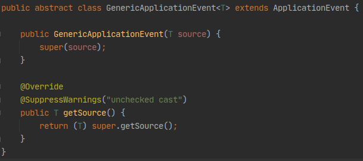
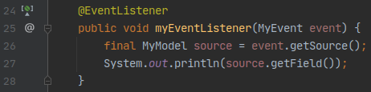
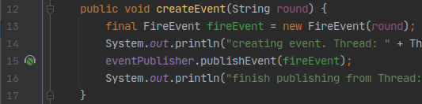

События Spring обрабатываются с помощью спрингового контекста приложения.

Для использования событий Spring достаточно подключить любую библиотеку, предоставляющую Spring Application Context.

<mark>//отдельную заметку про стандартные события спринга</mark>

<mark>//в заметку про транзакции (которой еще нет) включить раздел про `@TransactionalEventListener`</mark>


### Поток управления

По умолчанию публикация событий и их обработка слушателями происходит синхронно - в одном и том же треде. То есть после публикации поток управления переходит к слушателям, а потом возвращается в компонент, где событие было опубликовано. Подробнее об этом смотри в соответствующем разделе.

### Достоинства и недостатки

Архитектура, построенная на событиях, позволяет избавиться от хаотичного инжекта компонентов друг в друга. Таким образом:
- уменьшается связность между компонентами
- решается проблема циклической зависимости компонентов

Но одновременно с этим размывается поток управления при исполнении кода, завязанного на асинхронных событиях.

---
## События Events

Каждое событие должно наследоваться от абстрактного класса `ApplicationEvent`.

*Примечание* - в новых версиях Spring (начиная с 4.0) событием может быть любой объект, реализовывать какие-либо интерфейсы не нужно.

Событие привязывается к определенному объекту, поэтому при создании экземпляра события необходимо передать в родительский конструктор тот объект, с которым произошло событие
```java
public class FireEvent extends ApplicationEvent {
    @Getter
    private final String round;

    private FireEvent(final Object source, final String round) {
        super(source);
        this.round = round;
    }

    public FireEvent(final String round) {
        this(round, round);
    }
}
```

У каждого события есть два обязательных атрибута, которые можно вытащить с помощью геттеров:
- `source` - объект, с которым случилось событие.
- `timestamp` - время создания события. Заполняется при вызове конструктора.

### Критика

`ApplicationEvent` должен быть обобщенным, а его поле `source` должно быть не класса Object, а обобщенного типа.

Для того чтобы преодолеть такое неудобство можно написать свое расширение над `ApplicationEvent` :



---
## Публикация событий - ApplicationEventPublisher

Публикация события производится с помощью бина специального интерфейса - `ApplicationEventPublisher`. Этот интерфейс реализовывается спринговым контекстом `ApplicationContext`.

Этот бин инжектится в нужный компонент любым доступным способом, после чего можно вызывать его метод `publishEvent()` и публиковать событие.
```java
@Component
@RequiredArgsConstructor
public class EventGenerator {
    private final ApplicationEventPublisher eventPublisher;

    public void createMyEvent() {
        final MyModel model = new MyModel("test field");
        final MyEvent myEvent = new MyEvent(model);
        this.eventPublisher.publishEvent(myEvent);
    }
}
```

Интерфейс `ApplicationEventPublisher` является функциональным, что по идее дает возможность использовать его в виде лямбда-выражений, но как это сделать - непонятно.

<mark>//что дает функциональный интерфейс ApplicationEventPublisher?</mark>


---
## Прослушивание событий

### Интерфейс `ApplicationListener<>`

Устаревшим вариантом является реализация компонентом интерфейса `ApplicationListener<>` и его метода `onApplicationEvent()`.
```java
@Component
public class MyEventListener implements ApplicationListener<MyEvent> {
    @Override
    public void onApplicationEvent(final MyEvent event) {
        System.out.println(event.getSource().getField());
    }
}
```

Более прогрессивным способом, появившимся в Spring 4.2 является использование аннотации `@EventListener`

### Аннотация `@EventListener`

Для того чтобы получить событие в произвольном компоненте необходимо завести в нем метод, помеченный аннотацией `@EventListener`.

В качестве аргумента такой метод должен принимать объект того класса события, на которое он должен реагировать. Остальные события этим методом не воспринимаются. Таким образом с помощью структуры наследования (реализации интерфейсов) можно гибко настроить различных слушателей.

```java
@Component
public class EventCustomer {
    @EventListener
    public void myEventListener(MyEvent event) {

        final MyModel source = (MyModel) event.getSource(); //приходится явно кастить

        System.out.println(source.getField());
    }
}
```

Если метод должен обрабатывать только несколько реализаций какого-либо общего интерфейса / абстрактного класса событий это можно настроить с помощью атрибута `classes`
```java
@EventListener(classes = {MyFirstEvent.class, MyThirdEvent.class})
public void onMyEvent(MyEvent event) { /* */ }
```

### Порядок слушателей

По умолчанию слушатели одного события вызываются в произвольном порядке. Для того чтобы установить порядок выполнения методов-слушателей, нужно повесить над ними аннотацию `@Order`.
```java
    @Order(1)
    @EventListener
    public void customer1(FireEvent event) {
        System.out.println(String.format(TEMPLATE, event, 1, Thread.currentThread().getName()));
    }

    @Order(2)
    @EventListener
    public void customer2(FireEvent event) {
        System.out.println(String.format(TEMPLATE, event, 2, Thread.currentThread().getName()));
    }
```

### Фильтрация с помощью SpEL

Аннотация может быть сконфигурирована таким образом, чтобы фильтровать часть событий. Это делается с помощью SpEL.

<mark>//вставить фрагмент</mark>

### Цепочки событий

Если метод, над которым стоит аннотация `@EventListener`, возвращает не void, то возвращаемый объект тоже публикуется как событие.

Если метод возвращает коллекцию, то каждый из элементов этой коллекции будет опубликован как событие.

Таким образом можно выстраивать цепочки событий и их обработчиков.

### Обработка исключений

Все проверяемые исключения, которые могут быть выброшены в методе слушателя, оборачиваются в `UndeclaredThrowableException`

---
## Асинхронность

По умолчанию публикация события и обработка полученных событий происходят в одном треде. То есть поток управления после публикации события переходит к слушателям до тех пор пока каждый из них по очереди не обработает событие, после чего поток управления возвращается туда, откуда было опубликовано событие.

Это может привести к блокировке всего треда, если один из слушателей зависнет.

Для того чтобы обеспечить асинхронность каждого слушателя, требуется сконфигурировать приложение одним из способов.

### Опасности асинхронности

- Асинхронные события не откатываются при ролбэке транзакции.
- Выброшенные в слушателе исключения не доходят до места публикации событий и остаются в том треде, в котором они были брошены (и помирают вместе с ним).
- Асинхронные события не могут выстраивать цепочки событий. Возвращаемое значение метода с аннотацией `@EventListener` никуда не публикуется.

### Конфигурация с помощью бина

Распределением событий по слушателям занимается бин, реализующий интерфейс `ApplicationEventMulticaster`. По умолчанию это объект класса `SimpleApplicationEventMulticaster`, который запускает слушателей в том же треде, в котором было опубликовано событие.

Для того чтобы обрабатывать события в различных потоках нужно переопределить в данном бине поле `taskExecutor` на асинхронный экзекьютор:
```java
@Configuration
public class EventListenerConfig {
    @Bean
    public ApplicationEventMulticaster applicationEventMulticaster() {

        final SimpleApplicationEventMulticaster eventMulticaster = new SimpleApplicationEventMulticaster();

        eventMulticaster.setTaskExecutor(new SimpleAsyncTaskExecutor());
        return eventMulticaster;
    }
}
```

При этом можно установить максимальное количество тредов с помощью параметра `concurrencyLimit` экзекьютора.

### Конфигурация с помощью аннотаций

Современным способом конфигурирования асинхронности получения событий являются аннотации `@Async`, которые ставятся над теми методами-слушателями, которые должны быть вызваны асинхронно (в отдельных тредах)
```java
    @Async
    @EventListener
    public void onFireEvent(FireEvent event) {
        System.out.println(event);
    }
```

Для того чтобы включить асинхронность в своем приложении, необходимо повесить аннотацию `@EnableAsync` над одним из конфигурационных классов:
```java
@Configuration
@EnableAsync
public class EventListenerConfig {
}
```

---
## Интеграция с Intellij IDEA

Intellij IDEA помечает все места в коде, где публикуются события и где они принимаются, позволяя быстро перемещаться между ними.





---
## К изучению
- [X] Javadoc на классы
- [X] Статья на Baeldung: https://www.baeldung.com/spring-events
- [X] Статья на русском: https://springgears.com/spring-events/
- [ ] Стандартные спринговые события. Baeldung: https://www.baeldung.com/spring-context-events