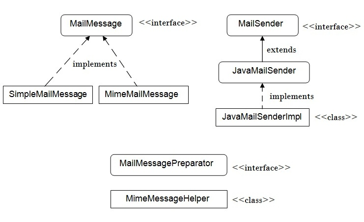

**Spring Email**

Библиотека основана на библиотеке Jakarta Mail.

Основная задача библиотеки - упростить отправку сообщений из Java-приложений.

### Основные классы, предоставляемые библиотекой

- `MailSender` - интерфейс верхнего уровня, предоставляющий базовый функционал для отправки простых email'ов.
- `JavaMailSender` - наследует MailSender, поддерживает MIME сообщения. Чаще всего используется вместе с MimeMessageHelper для создания MimeMessage.
- `SimpleMailMessage` - используется для создания простых e-mail'ов, включающих тему, адресата, адресанта и текст.
- `MimeMessagePreparator` - предоставляет callback интерфейс для подготовки MIME сообщений
- `MimeMessageHelper` - класс для создания MIME сообщений. Поддерживает картинки, вложения и пр.

---
## К изучению

- [X] Моя [статья про работу с электронной почтой из Java приложений](https://habr.com/ru/post/526162/)
- [ ] [Guide](https://www.baeldung.com/spring-email) on Baeldung: 
- [ ] [Официальная документация](https://docs.spring.io/spring/docs/5.1.18.BUILD-SNAPSHOT/spring-framework-reference/integration.html#mail)