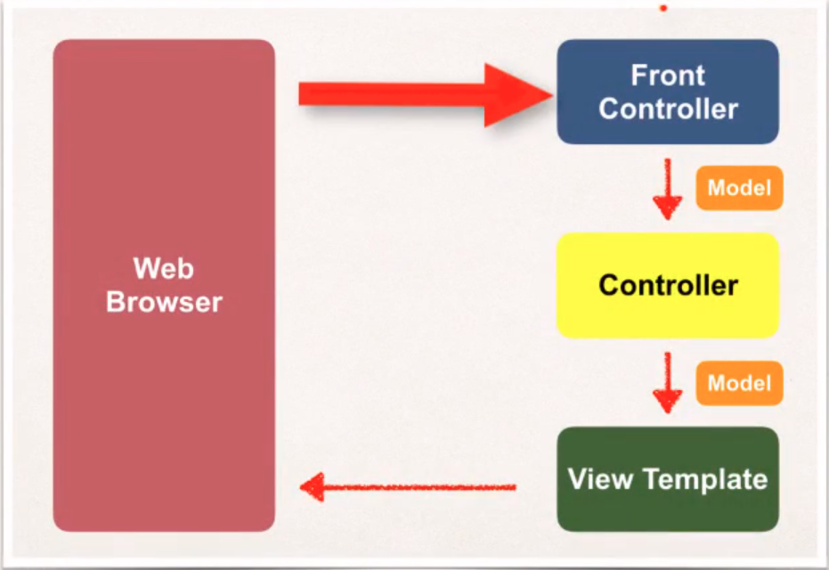

**Spring MVC** - один из фреймворков, входящих в состав [Spring](spring.md).

Spring MVC предназначен для создания веб-приложений с использованием [паттерна MVC](../patterns/mvc.md).

С помощью Spring MVC создаются веб-приложения, которые имеют только серверную часть, а для генерации веб-страниц используются различные шаблонизаторы:

- ThymeLeaf
- [JSP](../jsp/jsp.md)
- Velocity
- Freemarker

Для получения данных из форм html в Java-код используются специальные вставки в html-верстку, которые называются [Spring MVC Form Tags](mvc_form_tags.md).

Для того чтобы воспользоваться Spring MVC необходимо подключить зависимости, относящиеся к [Spring Bean](beans.md) и дополнительно *spring-web* и *spring-webmvc*.

---
## Структура Spring MVC приложения



При запросе от пользователя первым делом он попадает в Front Controller, в Spring его роль выполняет `DispatcherServlet`, который ...

Конфигурация диспетчера сервлетов производится одним из способов:

- xml-файлы: web.xml, в котором регистрируются сервлеты, и contextConfig.xml, который работает как обычный спринговый конфигурационный файл.
- Java-код

В конфигурационном файле указывается сервлет, который будет искать шаблоны с указанным расширением в указанной директории:
```xml
<bean class="org.springframework.web.servlet.view.InternalResourceViewResolver">
    <property name="prefix" value="/WEB-INF/view/" />
    <property name="suffix" value=".jsp" />
</bean>
```

---
## Контроллеры

Контроллерами являются обычные Java-классы.

Для того чтобы указать Spring, что данный класс является контроллером, над ним ставится аннотация @Controller. Эта аннотация наследуется от аннотации @Component, поэтому контроллеры являются точно такими же бинами, как и другие компоненты Spring-приложения.
```java
@Controller
public class MyController { /**/ }
```

### Идентификатор ресурса

Каждый контроллер может содержать в себе несколько endPoint'ов - ресурсов, которым присвоен определенный URI. Такие ресурсы являются обычными Java-методами, которые вызываются, когда приходит запрос по указанному URI. Идентификатор ресурса указывается с помощью аннотации `@RequestMapping(String)` над методом.

Метод обычно возвращает имя файла шаблона, который должен быть возвращен пользователю. Например, для шаблона `helloWorld.jsp`:

```java
@RequestMapping("/info")
public String getInfo() { return "helloWorld"; }
```

Аннотация `@RequestMapping` может быть поставлена не только над методом, но и над классом. В таком случае она будет назначать подпуть для всех методов-ресурсов:

```java
@RequestController("/appInfo")
public class MyController {

    @RequestMapping("/version")

    public String getVersion() { /* */ } //доступно по URL <host>/appInfo/version

    @RequestMapping("/requestPerSec")

    public String getRPS() { /* */ } //доступно по URL <host>/appInfo/requestPerSec

}
```

При этом переход между страницами с одним родительским путем может осуществляться без указания полного пути.

### Передача / получение данных

Данные могут приходить в ресурс различными способами:

- в параметрах URL
- в пути URL

Для получения параметров URL можно использовать аннотацию `@RequestParam(String)`, которая ставится перед аргументом метода, и самостоятельно извлекает параметр с нужным именем и присваивает его аргументу.
```java
@RequestMapping("/info")
public String getInfo(@RequestParam("version") String apiVersion) {
    //...
}
```

Для получения данных из пути URL можно использовать аннотацию `@PathVariable(String)`, которая ставится перед аргументом метода и встраивается в путь в фигурных кавычках
```java
@RequestMapping("/task/{id}")
public String getTask(@PathVariable("id") Integer id) {
    //...
}
```

Если данные, приходящие в ресурс, в Java-коде представлены перечислениями, то необязательно принимать их в строковом виде, а затем вручную переводить в enum. Перечисления могут парситься автоматически при написании специального конвертера. **Конвертер** должен быть унаследован от спрингового конвертера `Converter<IN, OUT>`

```java
public class StringToMaterialTypeConverter implements Converter<String, MaterialType> {

    @Override
    public MaterialType convert(final String materialTypeValue) {
        return MaterialType.valueOf(materialTypeValue.toUpperCase());
    }
}
```

При возникновении ошибки парсинга строки в перечисление будет выброшено исключение `ConversionFailedException`, которое автоматически обрабатывается спрингом как 400 Bad Request.

Конвертер необходимо зарегистрировать в наследнике `WebMvcConfigurer`
```java
@Configuration
public class WebConfig implements WebMvcConfigurer {
    @Override
    public void addFormatters(FormatterRegistry registry) {
        registry.addConverter(new StringToMaterialTypeConverter());
    }
}
```

<mark>//Конвертация в перечисление может происходить с помощью Jackson аннотации @JsonValue без необходимости написания конвертера. Переписать этот фрагмент</mark>

---
## Модель

Модель - это некий аналог атрибутов страницы (или запроса?) в сервлетах.

Модель представляет собой мапу, где объекты хранятся по строковому ключу-имени.

Для всех моделей существует общий интерфейс Model, который предоставляет следующие методы:

- `Model addAttribute(String, Object)` - добавляет атрибут в модель по имени-ключу
- `boolean containsAttribute(String)` - true если в модели есть атрибут с таким именем
- `Object getAttribute(String)` - достает атрибут из модели по ключу
- другие методы

Для того чтобы получить значение атрибута в эндпойнте можно воспользоваться аннотацией `@ModelAttribute(String)`, которая ставится перед аргументом метода:
```java
@RequestMapping("/info")
public String getInfo(@ModelAttribute("person") Person person) {
    //...
}
```

Атрибут с нужным именем будет извлечен из модели и скастован к нужному классу / интерфейсу автоматически.

---
## К изучению

- [ ] [Официальная документация](https://docs.spring.io/spring/docs/current/spring-framework-reference/web.html) на Spring MVC
- [X] Курс Spring & Hibernate for Beginners на Udemy
- [X] [Перечисления в параметрах URL](https://www.baeldung.com/spring-enum-request-param)