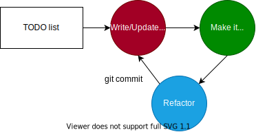

# TDD

__TDD__ - Test Driven Development или разработка через тестирования.

Основная идея заключается в том, чтобы начинать писать тесты до промышленного кода.
При этом разработка происходит итеративно: сначала пишется тест, затем пишется минимальный код, который обеспечивает прохождение этого теста.
Цикл за циклом пишутся новые тесты и дописывается промышленный код.
При необходимости проводится рефакторинг.

Этот цикл разработки в литературе по TDD называется: red-green-refactoring, где цвета отражают проходимость теста.

Роберт Мартин называет эти шаги тремя законами TDD:
1. Не пишите код, пока не напишете первый тест.
2. Пишите минимальный тест, который не будет пройден. Добейтесь его прохождения, написав необходимый код.
3. Ограничьтесь минимальным количеством кода, необходимым для прохождения текущего теста. После этого сразу пишите следующий тест.

Адептами TDD считается, что тесты, написанные таким образом, являются лучшей технической документацией для промышленного кода.

## Правила TDD

В книге "Идеальная работа" Роберт Мартин в ходе повествования вводит некоторые утверждения, которые он называет правилами TDD:
1. Напишите тест для проверки кода, который вы собираетесь написать.
2. Сделайте так, чтобы тест перестал проходить. Сделайте так, чтобы он снова начал проходить. Очистите код.
3. Не гонитесь за золотом (не пишите тест сразу на happy path)
4. Пишите самый простой, самый конкретный, самый вырожденный тест, который не будет пройден.
5. По возможности обобщайте.
6. Если вам кажется, что с кодом что-то не так, то внесите коррективы в проект и только потом продолжайте работу.
7. Полностью протестируйте текущий, более простой случай и только потом переходите к более сложному.
8. Если для прохождения текущего теста требуется написать слишком много кода, то удалите этот тест и напишите более простой, который будет легче пройти.
9. Пошагово следуйте найденному шаблону, который охватывает тестовое пространство.
10. Не включайте в тесты вещи, которые там не требуются.
11. Не используйте в тесте промышленные данные.
12. Отделяйте структуру тестов от структуры производственного кода.
13. По мере того как тесты становятся более конкретными, код становится более общим.
14. Если одна трансформация приводит к неоптимальному решению, то попробуйте другую трансформацию.

## Паттерны
Дальше следуют плохо оформленные разорванные мысли с тренинга по TDD

### Паттерны красной зоны
- Assert First - начать тест писать с ассерта
- Starter Test - если не знаешь с какого теста начать, напиши хоть что-нибудь
- Do over - 
- One Step Test - каждый тест на единицу поведения

### Паттерны зеленой зоны
- Fake It until you make it - 
- Obvious implementation - 
- Triangulate - 
- One to Many - 

## Очередность трансформаций

Применяя цикл TDD red-green-refactoring можно заметить, что продуктовый код в процессе рефакторинга изменяется по некоторым типовым маршрутам:

1. `{}` -> `null` - если нужно что-то вернуть из метода, то первым делом возвращаем `null`
2. `null` -> константа - `null` преобразуется в константу, чтобы начал проходить первый тест
3. константа -> переменная
4. переменная -> коллекция - переменная может превратиться в массив, в список или в другую коллекцию, когда окажется, что нужно хранить историю чего-либо
5. оператор -> рекурсия
3. `if` -> `while` - условия часто превращаются в циклы

---
## Мои мысли

Во всех примерах использования TDD, разработчик всегда точно знает, какой результат он хочет получить, какой контракт будет у реализуемого им кода.
Например, в книге "Идеальная работа" Роберт Мартин начинает писать тесты на структуру данных стек и в первом же тесте у него появляется метод `isEmpty()`.
Почему он решил, что этот метод должен быть в классе - мне непонятно.
Начиная писать стэк, ты задумываешься о его основном функционале, и это функции вставки и извлечения.
Стек может обойтись и без проверки на пустоту.

Этот пример обнажает неполноценность TDD.
На мой взгляд разработка должна начинаться не с тестов, а с выяснения требований.
Только после того, как понятен требуемый функционал, можно начинать накидывать тест-кейсы на него.

### Сравнение с алгоритмами оптимизации

TDD немного похож на алгоритм оптимизации, когда ищется сочетание значений нескольких переменных, которое дает наиболее эффективный результат.
В таких алгоритмах поиск, как правило, ведется постепенным изменением значений и подсчетом результата.
Так и в TDD мы последовательно уточняем наши требования с помощью тестов, и потом приводим поведение кода к желаемому состоянию.

Проблемой оптимизационных алгоритмов является то, что они могут привести к локальному максимуму, проигнорировав глобальный максимум.
На мой взгляд TDD тоже может привести к тому, что после очередного цикла был проведен рефакторинг, сильно меняющий структуру кода. Но после добавления еще одного теста может оказаться, что структура компонентов кода, полученная на предыдущей итерации, совершенно не годиться для выполнения новых требований.

Р. Мартин в своей книге также предполагает, что TDD - это хороший способ пошаговой разработки плохих алгоритмов.

---
## К изучению
- [ ] Кент Бэк. Экстремальное программирование. Разработка через тестирование - 2020 г.
- [X] Роберт Мартин. Идеальная работа - 2022 г. Главы 2-4
