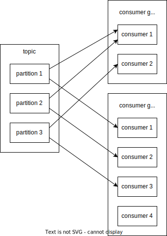

# Apache Kafka

**Apache Kafka** - это лог событий.
Kafka поставляется в виде кластера.

Иногда Kafka называют очередью сообщений, но это не совсем верно, потому что Kafka в отличие от очереди не позволяет выкидывать из нее объекты.

Kafka может использоваться для:
- интеграции различных систем
- распределенного лога
- потоковой обработки

В Kafka записываются события (**Event**).
Событие - это уведомление о состоянии какой-либо сущности.
Например, результат измерения температуры котла в определенный момент времени.

События записываются в топики.
**Топик** - это бесконечный свиток, в который записываются события, объединенные по какому-то признаку. 
Все новые события дозаписываются в конец топика.
Топики персистентны и по умолчанию из них ничего не удаляется, но при желании можно выставить ограничение на размер топика или на срок жизни записей.

Внутри Kafka событие представляется в виде пары ключ - значение.
Ключ необязательно должен быть уникальным.
Скорее ключ - это тип события.

Данные в Kafka хранятся в виде массива байт.
Поэтому чаще всего данные сериализуются в массив байт с помощью какого-либо бинарного формата. 
Например: Avro, Protobuf или JSON в кодировке UTF-8.


## Партиционирование топиков

Для того чтобы иметь возможность параллельной обработки данных из топиков, их дробят на **партиции**.
Партиции в Kafka также называют единицей параллелизма.
Каждая партиция может храниться на своей ноде кластера Kafka.
Можно хранить несколько партиций на одной ноде, но нельзя одну партицию размазывать на несколько нод.

События распределяются по партициям на основании значения ключа.
От ключа высчитывается хэш и берется остаток от деления на количество партиций.
Полученное число - номер партиции, в которую попадет запись.
Если ключ не задан, то партиции распределяются равномерно по алгоритму [round robin](../algorithms/round_robin.md).

Гарантии упорядоченности работают только в пределах одной партиции.

### Как выбрать количество партиций
Это интересный вопрос, на который нет однозначного ответа.
Количество партиций должно быть как минимум не меньше количества консьюмеров, которыми мы будем читать топик.
Но при этом Kafka иногда неравномерно распределяет партиции по консьюмерам.
Возможна ситуация, когда один из консьюмеров вообще не получит партиций, потому что их будет обрабатывать другой консьюмер.
Например, при 10 партициях и 5 консьюмерах идеальным распределением будет 2-2-2-2-2, но на практике партиции могут распределиться 3-3-2-2-0.

Делать слишком большое количество партиций тоже опасно.
Так как от количества партиций зависит продолжительность ребалансировки партиций между консьюмерами при входе/выходе консьюмера в/из группу (это неподтвержденный факт, в источниках подобное не описано, но очевидцы (Антон Б.) утверждают, что это так).
Также от количества партиций очень сильно зависит продолжительность ребалансировки партиций при вылете брокера из кластера (а это уже подтвержденный факт).
Рекомендуется, чтобы на одном брокере было не больше 4к, а общее количество партиций в кластере не превышало десятков тысяч.

Каждая партиция - это файл, поэтому для каждой партиции на брокере ему приходится держать открытым файловый дескриптор.
Из-за этого при большом количестве партиций может начать ругаться ОС, но это легко решается увеличением допустимых лимитов.

Седые старцы из Тинькофф рекомендуют выбирать количество партиций равным количеству консьюмеров, а при необходимости горизонтального масштабирования консьюмеров, докидывать партиции.

Другие седые старцы советуют делать так, чтобы количество партиций было кратным количеству брокеров и количеству консьюмеров.
Например, если брокеров 3, а консьюмеров 4, то выбирать количество партиций 12 или 24.
Тогда партиции будут приблизительно равномерно распределяться между брокерами и консьюмерами.

Особенно осторожным следует быть при выборе количества партиций для топиков, в которые запись идет по ключу. 
Потому что при увеличении количества партиций во время миграции данных и перераспределении партиций по брокерам может нарушиться гарантия упорядоченности.
Поэтому для топиков, в которые идет запись по ключу, рекомендуют всегда заранее задавать количество партиций чуть больше, чем необходимо, чтобы отдалить момент, когда потребуется масштабирование.


## Брокеры

Брокер - это конкретный инстанс Kafka, входящий в кластер.
Это JVM процесс, запущенный на сервере или в контейнере.
Каждый брокер отвечает за обработку одной или нескольких партиций.
Также брокеры занимаются репликацией данных между друг другом.

Главная нода в кластере брокеров называется контроллером.
Контроллер отвечает за распределение партиций по брокерам и за контроль за состоянием брокеров.


## Репликация

Для того чтобы не потерять данные при выходе из строя одного из брокеров, партиции реплицируются между различными брокерами.
Главная партиция называется **лидер-репликой**, а запасные - **follower-репликами**. 
Чтение и запись всегда происходит через лидер-реплику. 
Лидер-реплика сама реплицирует новые данные фолловерам.

При падении брокера, на котором находилась лидер-реплика, лидером становится одна из follower-реплик.


## Хранение
Данные в Kafka хранятся персистентно на диске.
Каждая партиция представляет собой файл.
Kafka позволяет регулировать срок хранения сообщений в партиции с помощью настроек, называемых __retention__.
Существует два типа retention:
- на основе времени - из партиции стираются сообщения, которые были записаны дольше заданного времени назад
- на основе размера лога


## Распределенность

В Kafka для оркестрирования различными брокерами в кластере используется отдельное приложение - **ZooKeeper**.
ZooKeeper сам тоже является распределенной системой. 
Рекомендуется поднимать кластер ZooKeeper с нечетным количеством нод: 3, 5 и т.д.
Поднимать больше 7 нод не рекомендуется, т.к. начнет страдать производительность.

Один кластер ZooKeeper может обслуживать несколько кластеров Kafka и это норма.

По состоянию на начало 2022 года прорабатывается возможность перехода на собственную систему нахождения консенсуса, но произойдет это не раньше версии 4.0.


## Продюсеры и Консьюмеры

**Продюсеры** пишут в Kafka, **консьюмеры** - читают из нее.
Продюсеры и консьюмеры представлены в виде клиентских библиотек для Java.

<mark>Описать подробнее</mark>

```java
KafkaProducer
ProducerRecord

KafkaConsumer
ConsumerRecord
```


### Консьюмеры

Топики могут читаться несколькими консьюмер группами. 
Каждая группа имеет свой **оффсет**.
Оффсет - это смещение записи, которую сейчас обрабатывает консьюмер группа, относительно начала топика.
Метафорой для оффсета из реального мира является книжная закладка, которая указывает на определенную страницу в книге.
С той оговоркой, что в этой книге постоянно добавляются новые страницы.



В одну группу обычно входят инстансы одного приложения.
Каждый консьюмер в группе читает свои партиции.
Распределение партиций между консьюмерами осуществляется Kafka - самому настраивать ничего не нужно.
При изменении количества консьюмеров в группе (падение инстанса, поднятие нового пода), партиции автоматически перераспределяются.
Количество консьюмеров в группе не должно превышать количество партиций, иначе останутся консьюмеры, которые вообще ничего не читают.
Желательно, чтобы количество партиций было кратно количество консьюмеров в группе.
Но иногда специально делают так, чтобы количество консьюмеров было чуть больше количества партиций.
Тогда при падении одного из консьюмеров, на его место становится тот, который раньше простаивал, и система не теряет в производительности.

Интересно, что распределением партиций по консьюмерам в группе занимается не Кафка, а сами консьюмеры.
Для этого в группе есть ведущий консьюмер, а для каждой группы назначается координатор из числа брокеров Кафки.
Когда к группе подключается новый консьюмер он отправляет координатору запрос на присоединение, и координатор запрашивает у ведущего как перераспределить партиции.
Ведущий консьюмер формирует новый план распределения партиций и отвечает координатору.
Координатор затем сообщает каждому консьюмеру в группе какие партиции он должен начать читать.
Благодаря такой схеме, можно выбрать алгоритм распределения партиций на клиентской стороне и даже написать свой собственный алгоритм.
Существуют следующие стандартные стратегии (реализации интерфейса `ConsumerPartitionAssignor`):
- `Range` - (по умолчанию) распределяет партиции каждого топика по Round Robin, каждый топик начиная с первого консьюмера. Из-за это на первые несколько консьюмеров нагрузка будет всегда больше, чем на остальные при некратном количестве партиций и консьюмеров.
- `RoundRobin` - обычный [Round Robin](../algorithms/round_robin.md) алгоритм. Равномерно распределяет партиции всех топиков между консьюмерами.
- `Sticky` - сбалансированный, как `RoundRobin`, но при этом еще и пытается сохранить как можно больше партиций на своих местах при входе/выходе консьюмера в/из группы.
- `CooperativeSticky` - то же, что и `Sticky`, но к тому же поддерживается инкрементальная ребалансировка (cooperative rebalance)

На первый взгляд кажется, что `CooperativeSticky` - это лучшая из возможных стратегий, но нужно поразбираться какие недостатки она может нести.


## Экосистема Kafka

В экосистему Kafka помимо Kafka брокеров и клиентских библиотек входят еще несколько продуктов:
- [Kafka Connect](kafka_connect.md) - инструмент для переливки данных между различными хранилищами и Kafka
- [Schema Registry](./kafka_schema_registry.md) - база данных на основе Kafka, в которой хранятся схемы сообщений (`.proto`, `.avsc` или `.json-schema`). Разворачивается в виде распределенного приложения с REST интерфейсом. Библиотеки продюсеров и консьюмеров имеют встроенных клиентов для обращения к Schema Registry. Особенно Schema Registry полезна, когда мы используем Kafka в качестве асинхронного публичного API, тогда пользователи API смогут узнать о формате сообщений из Schema Registry.
- Kafka Streams - Java API, позволяющий в функциональном стиле обрабатывать приходящие сообщения в консьюмере, обогащая их данными из других источников.
- ksqlDB - отдельное распределенное приложение, подключающееся к кластеру Kafka и предоставляющее REST интерфейс. Этот интерфейс может использоваться для стриминговой обработки данных с помощью SQL запросов (какая-то ведьминская магия).
- Mirror Maker - репликация данных между несколькими ЦОДами


## Мониторинг Kafka
Мониторинг Kafka осуществляется через JMX.
Данные о порте, на котором открыт JMX эндпойнт у брокера, можно найти в ZooKeeper.

Зачастую Kafka используется как один из элементов системы мониторинга.
Поэтому важно мониторить ее отдельно, ведь если она сломается, то сломается и общий мониторинг.

На что стоит смотреть:
- __under replicated partitions__ - это количество партиций, по которым отстает репликация с главной реплики на ISR. Если эта метрика отлична от нуля, то возможно один из брокеров отключился от кластера.


## Инструменты для работы с Kafka

- __AdminClient__ - API, входящий в Java библиотеку Kafka Client, позволяющая программно взаимодействовать с кластером Кафки.
- [Kafdrop](https://github.com/obsidiandynamics/kafdrop) - отдельный сервис, который нужно поднять на своем сервере где-нибудь рядом с Kafka. 
  Позволяет посмотреть список топиков, консьюмер групп и даже вычитать из топика несколько записей с произвольного офсета. Интерфейс не очень удобен, приложение иногда падает с OutOfMemory - видимо течет память.
  Код открытый, приложение написано на Spring Boot.
  Использует Kafka AdminClient для получения данных о кластере.
- [Conductor](https://www.conduktor.io/) - десктопное приложение. Бесплатно для одного брокера. Не пробовал
- [akhq](https://akhq.io/) - отдельный сервис, который нужно поднять на своем сервере где-нибудь рядом с Kafka. Не пробовал
- [kcat](https://github.com/edenhill/kcat) - CLI для Kafka. Не пробовал
- [CMAK](https://github.com/yahoo/CMAK) - отдельный сервис, который нужно поднять на своем сервере где-нибудь рядом с Kafka. Не пробовал
- kafkalityc - плагин для IDEA. Позволяет посмотреть список топиков, консьюмер-группы и вычитать несколько записей с определенным офсетом. 
  Иногда выдает NPE.

## Релизы
- 3.0 - задепрекейчен MirrorMaker 1. Добавлена возможность инкрементального обновления стратегии ребалансировки партиций между консьюмерами
- 2.4 - добавлена возможность cooperative rebalancing при перебалансировке партиций. Релизнулся MirrorMaker 2, основанный на Kafka Connect.
- 2.3 - static group membership
- 1.1 - добавлено кэширование сессий консьюмеров на стороне брокеров
- 1.0 - добавлена возможность подписки на топики, подходящие по [регулярному выражению](../java/regexp.md)
- 0.11 - появился Admin Client, у записей появились header'ы
- 0.10 - у записей появился timestamp, в брокерах появился индекс по timestamp

Раздел будет дополняться по мере того, как я буду встречаться с новыми фичами

---
## К изучению

- [X] [Краткий курс от Confluent](https://developer.confluent.io/learn-kafka/apache-kafka/events/)
- [ ] Книга Apache Kafka. Потоковая обработка и анализ данных (2 издание 2021 г. - соответствует Kafka 2.5.0)
- [ ] [Официальный сайт](https://kafka.apache.org/)
- [ ] [Рекомендацию по именованию топиков](https://devshawn.com/blog/apache-kafka-topic-naming-conventions/)
- [X] [Рекомендации по выбору количества партиций](https://www.confluent.io/blog/how-choose-number-topics-partitions-kafka-cluster/)
- [X] [Стратегии распределения партиций по консьюмерам](https://medium.com/streamthoughts/understanding-kafka-partition-assignment-strategies-and-how-to-write-your-own-custom-assignor-ebeda1fc06f3)
- [ ] [Описание работы ребалансировки партиций](https://medium.com/streamthoughts/apache-kafka-rebalance-protocol-or-the-magic-behind-your-streams-applications-e94baf68e4f2)
- [X] Г. Кошелев - [Когда все пошло по Kafka 3: Apache Kafka и Consumer](https://www.youtube.com/watch?v=NXU_F_7STSM&t=1s&ab_channel=JPoint%2CJoker%D0%B8JUGru). 53:43