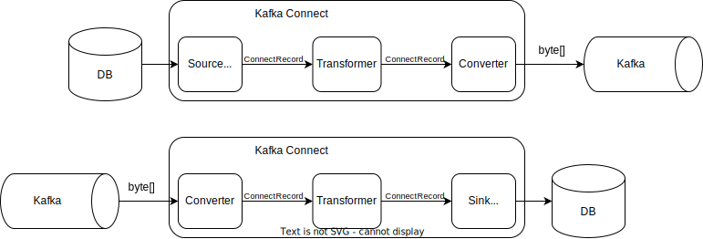

# Kafka Connect

**Kafka Connect** - это инструмент для конвейерной (стриминговой) переливки данных между Кафкой и различными хранилищами данных: реляционные БД, key-value хранилища, распределенные индексы, файловые хранилища и т.д.
Kafka Connect - это конвейер данных, одной из сторон которого всегда выступает Kafka.
Переливка данных осуществляется по принципу [ETL](../architecture/etl.md).

Реализовать функционал Kafka Connect можно самостоятельно с помощью обычных Kafka продюсеров и консьюмеров, но тогда придется писать много шаблонного кода для работы с системой хранения данных, для обработки ошибок, хелфчеки и пр. Все это уже реализовано в Kafka Connect, к тому же там есть множество уже готовых коннекторов к различным системам хранения данных.

Большим преимуществом Kafka Connect является то, что он __fault tolerant__.
Например, если хранилище данных недоступно, то Kafka Connect будет накапливать данные в Kafka до момента, когда хранилище снова станет доступным.

Kafka Connect исповедует принцип **SMT** - Single Message Transform.
Это означает, что каждая запись обрабатывается независимо.
И хотя можно написать свой коннектор, который будет агрегировать данные из нескольких записей, делать это строго не рекомендуется.

## Устройство

Kafka Connect представляет собой кластер нод, которые называются **worker**.
**Worker**'ы - это обычные Java-приложения, каждый на своем инстансе JVM.
В кластер может быть загружено несколько **коннекторов**.

Kafka Connect может быть поднято в двух разных режимах:
- standalone
- distributed

В __standalone__ режиме данные о коннекторах, о текущем состоянии worker'а и оффсеты в Kafka хранятся локально в файлах. 
Такой режим не устойчив к отказам.
Используют его крайне редко и в основном для того, чтобы сгрузить в Kafka данные, находящиеся на том же хосте, что и kafka connect.
Как правило, это какие-то файлы. 

Основной режим использования - __distributed__, он же кластерный.
В этом случае все настройки и офсеты хранятся в Kafka в специальных топиках и не потеряются в случае падения Kafka Connect.

Управление кластером: загрузка новых коннекторов, получение информации о коннекторах, просмотр тасок и пр.,- производится через REST API.

Термин **Коннектор** имеет два значения:
- плагин Kafka Connect, описывающий конечные точки пайплайна и преобразования, происходящие с данными на этом пути. 
- код, который переводит данные хранилища из формата, принятого в хранилище, в `ConnectRecord` - модель данных, используемая в Kafka Connect. То же самое в другую сторону.

Значение определяется из контекста.

**Таски** - это процессы, которые выполняются внутри worker'а.
По сути это потоки, за счет которых можно параллелизовать обработку данных.
Например, в source коннекторах каждая таска может работать со своими партициями,
а в sink коннекторах каждая таска может выгружать свою таблицу.

**Конвертер** - это код, который переводит `ConnectRecord` в массив байт, записываемый в Kafka. Работает и в другую сторону.

Kafka Connect из коробки поддерживает конвертеры:
- Avro
- [Protobuf](../formats/protobuf.md)
- [JSON](../formats/json.md) с Json Schema
- Строки
- Массивы байт (видимо для записи файлов)

Рекомендуется использовать конвертеры со схемами: Avro, Protobuf, JSON с Json Schema.
Эти форматы позволяют развивать модель данных (убирать поля, добавлять новые), не боясь повредить существующие данные и не боясь разучиться их парсить. 
Объявления схем могут храниться в __Schema Registry__.

Если стандартных конвертеров не хватает, то всегда можно написать свой или найти готовый на просторах сети, и подложить его в Kafka Connect.


**Трансформации** - преобразования, которые применяются к каждой записи, проходящей через Kafka Connect. 
Трансформаторы исповедуют принцип SMT.

Все записи, проходящие через Kafka Connect, проходят этапы конвертации и трансформации. 
Последовательность выполнения этапов зависит от типа коннектора: Source или Sink.



### Коннекторы (плагины)

Коннекторы бывают двух видов:
- **Source** - источник. Коннектор такого типа вычитывает данные из системы хранения данных и записывает их в Kafka.
- **Sink** - потребитель. Такой коннектор переливает данные из Kafka в какую-либо систему хранения данных.

Функциональность коннектора описывается в формате [JSON](../formats/json.md):
```json
{
  "connector.class": "io.confluent.connect.jdbc.JdbcSinkConnector",
  "key.converter": "...",
  "value.converter": "..."
}
```

Коннекторы загружаются в кластер Kafka Connect с помощью REST API.

### Коннекторы (классы)

Коннекторы, как код, 

Существует множество готовых коннекторов, например для записи и чтения в РБД, записи в Elastic Search и т.д. 
Найти их можно в Confluent Hub.
Если ничего подходящего не нашлось, то придется писать самому.


## Обработка ошибок

В Kafka Connect существует три способа обработки ошибок.
- **Fast Fail** (дефолт) - При первой же ошибке Kafka Connect перестает выполнять таски по данному коннектору. Нужно будет прийти, разобраться в чем проблема и починить.
- **YOLO** - Все записи, по которым возникла ошибка, игнорируются. Коннектор не прекращает своей работы.
- **Dead Letter Queue** - Записи, которые не удалось обработать, записываются в отдельный топик Kafka. При выборе данного способа нужно не забывать заглядывать время от времени в DLQ на наличие ошибок. Можно, к примеру, прикрутить мониторинг.


## Трансформации
Пока данные переливаются можно их изменять с помощью трансформаций.

Стандартные трансформации:
- `ReplaceField` - изменяет название поля
- `TimestampConverter` - преобразует временные поля из одного формата в другой
- [другие](https://docs.confluent.io/platform/current/connect/transforms/overview.html)

Трансформации также описываются в JSON.
Сначала в поле `transforms` объявляются алиасы для всех трансформаций, применяемых к `ConnectRecord`.
Затем в отдельных полях каждой трансформации передаются настройки.
Обращение к конкретной трансформации делается через объявленный ранее алиас. 
Тип указывается в поле `type`. 
Настройки, уникальные для типа указываются также через точку. 
Названия настроек можно посмотреть в документации.
```json
"transforms": "foo, bar",
"transforms.foo.type": "org.apache.kafka.connect.transforms.ReplaceField$Value",
"transforms.foo.renames": "name:firstName",
"transforms.bar.type": "...",
```

Когда не хватает стандартных трансформаций, можно попробовать поискать с нужным функционалом на [Confluent Hub](https://www.confluent.io/hub/).
Если и там не нашлось подходящей, то можно написать свою трансформацию.

[todo]: # (Описать как реализовать свой трансформатор)


## Конвертеры

__Конвертер__ - это код, который переводит массив байт, считываемый из Kafka, в структурное представление (`ConnectRecord`).
Над этим структурным представлением можно выполнять трансформации и описывать маппинг на источники и сливы данных.
Конвертеры занимаются и обратным преобразованием: из `ConnectRecord` в массив байтов для записи в Kafka коннектором типа source.

Тип конвертера описывается в настройках конвертера:
```json
{
  "key.converter": "org.apache.kafka.connect.storage.StringConverter",
  "value.converter": "io.confluent.connect.protobuf.ProtobufConverter"
}
```

Из коробки Kafka Connect имеет следующие конвертеры:
- `AvroConverter` - `io.confluent.connect.avro.AvroConverter`
- `ProtobufConverter` - `io.confluent.connect.protobuf.ProtobufConverter`
- `JsonSchemaConverter` - `io.confluent.connect.json.JsonSchemaConverter`
- `JsonConverter` - `org.apache.kafka.connect.json.JsonConverter` - используется по умолчанию
- `StringConverter` - `org.apache.kafka.connect.storage.StringConverter` - используется по умолчанию для заголовков
- `ByteArrayConverter` - `org.apache.kafka.connect.converters.ByteArrayConverter`

`JsonConverter` может работать в двух режимах: со схемой или без. 
Это регулируется настройками
```json
"key.converter.schemas.enable": false,
"value.converter.schemas.enable": true,
```
Если схема включена, то каждое json сообщение должно содержать в себе структуру с описанием схемы вида:
```json
{
  "schema": {
    "type": "struct",
    "fields": [
      {
        "type": "string",
        "optional": false,
        "field": "name"
      }
    ],
    "optional": false,
    "name": "my_schema"
  },
  "payload": {
    "name": "value1"
  }
}
```

Можно написать и свой конвертер. 
Для этого нужно реализовать интерфейс `org.apache.kafka.connect.storage.Converter`.
Класс надо запаковать в jar и подложить в `etc/kafka-connect/jars`
Затем им можно будет воспользоваться, указав в настройках коннектора:
```json
{
  "key.converter": "org.apache.kafka.connect.storage.StringConverter",
  "value.converter": "dev.boiarshinov.kafka.connect.storage.MyLovelyConverter"
}
```

---
## Rest API
Kafka Connect предоставляет REST API, позволяющий управлять коннекторами.

- `GET /` - базовая инфа о сервисе
- `GET /connectors?expand=status&expand=info` - информация о коннекторах
- `GET /connector-plugins` - можно посмотреть какие плагины подключены
- `PUT /connector/{connectorName}/config` - создать или обновить коннектор. В тело передается json с конфигурацией.
- `DELETE /connector/{connectorName}` - удалить коннектор
- `GET /connector/{connectorName}/tasks` - информация о тасках конкретного коннектора
- `GET /connector/{connectorName}/topics` - с какими топиками работает данный коннектор
- `POST /connector/{connectorName}/restart` - рестартануть коннектор (не рестартует таски)
- `GET /connector/{connectorName}/tasks/0/status` - статус указанной таски
- `POST /connector/{connectorName}/tasks/0/restart` - рестартануть таску
- `PUT /connector/{connectorName}/pause` - приостановить все таски коннектора
- `PUT /connector/{connectorName}/resume` - возобновить все таски коннектора


---
## Мониторинг

Мониторинг за состоянием кластера Kafka Connect осуществляется через JMX.

---
## К изучению
- [X] Книга "Apache Kafka. Потоковая обработка и анализ данных". Глава 7
- [X] [Документация](https://docs.confluent.io/platform/current/connect/index.html)
- [X] [Видео-курс от Confluent](https://developer.confluent.io/learn-kafka/kafka-connect/intro/)
- [X] Хабр. [Как синхронизировать сотни таблиц базы в Kafka, не написав ни одного продюсера](https://habr.com/ru/company/mailru/blog/529484/) (Отличная статья) - 2020 г.

