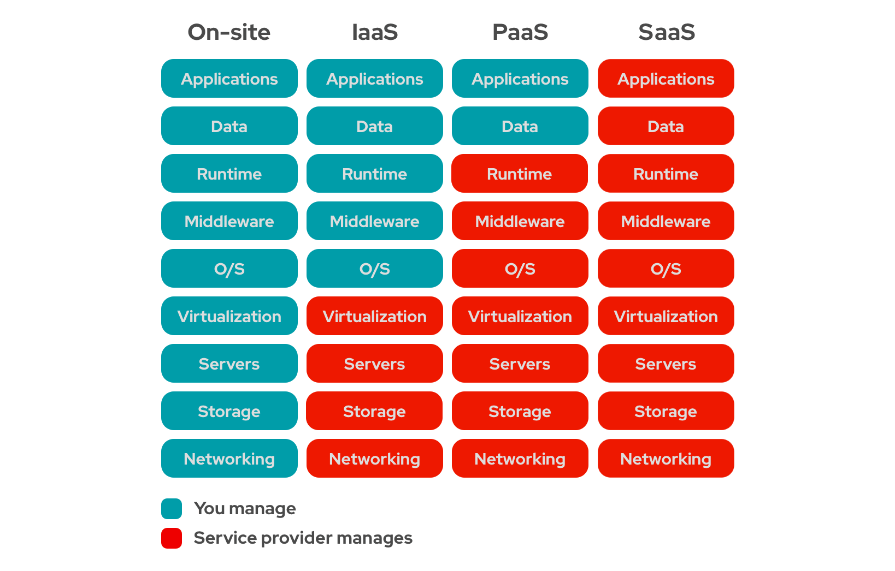

# Облачные вычисления

Облака противопоставляются ручному управлению всей инфраструктуры.

Выделяют несколько видов облаков:
- IaaS
- PaaS
- SaaS

Каждый последующий уровень снимает все больше обязанностей по управлению инфраструктурой с заказчика.

## IaaS
Тупо аренда железного сервера.
Ставить туда операционку, поднимать необходимое окружение придется самому.

Примеры: AWS, GCP, Selectel

## PaaS
Под платформой имеется в виду, что можно будет по кнопке задеплоить свое приложение или поднять БД, Kafka, etc.
Масштабирование, сервис-дисковери и прочее платформа берет на себя.

Примеры: AWS, GSP, Confluent Cloud, Heroku

## SaaS
Полностью готовое решение.
По сути ты, как пользователь, взаимодействуешь только с веб-интерфейсом системы.
Оплата по подписке (типа ты арендуешь ПО).

Примеры: Яндекс.Музыка, Firebase, Dropbox, Evernote

---
## К изучению
- [X] Статья [IaaS vs Paas vs SaaS](https://www.redhat.com/en/topics/cloud-computing/iaas-vs-paas-vs-saas) от Red Hat
- [X] [Wiki. SaaS](https://ru.wikipedia.org/wiki/%D0%9F%D1%80%D0%BE%D0%B3%D1%80%D0%B0%D0%BC%D0%BC%D0%BD%D0%BE%D0%B5_%D0%BE%D0%B1%D0%B5%D1%81%D0%BF%D0%B5%D1%87%D0%B5%D0%BD%D0%B8%D0%B5_%D0%BA%D0%B0%D0%BA_%D1%83%D1%81%D0%BB%D1%83%D0%B3%D0%B0)