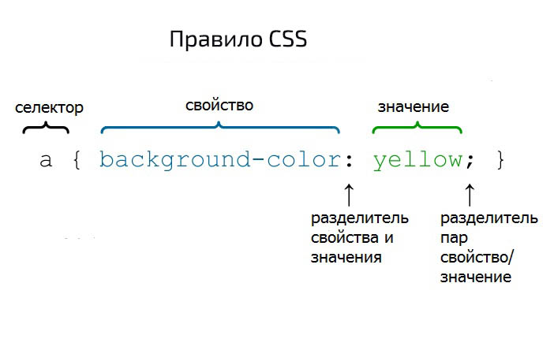

# Таблица стилей

Таблица стилей задает общие правила форматирования элементов верстки.

Правило задается с помощью селектора и определения свойств



В селекторе указываются элементы, к которым будут применены свойства. Например:
```css
/* Тут задаются правила для старшего заголовка */
h1 {
    color: green;
}
/* Тут задаются правила для абзацев */
p {
    font-size: small;
    font-family:
    sans-serif; color: black;
}
```

Все что в фигурных скобках называется блоком определения.

---
## Способы вызова селекторов

- Одиночный вызов - см. пример выше
- Групповой вызов
- Вызов по id - дурной тон
- Вызов класса - рекомендуемый способ
- Вызов для потомков

Селекторы можно группировать через запятую:
```css
p, ul, a {color: navy; }
```

Можно вызывать селекторы по id
```css
#id123 { color: red; }
```

Так как id являются уникальными - можно не писать тип элемента, а обращаться только по id

Элементы html могут быть сгруппированы в классы, к которым будут применяться одинаковые правила разметки, для этого в html-документе в тегах этих элементах должно быть присвоено значение атрибуту class
```html
<p class="OrangeColor">Текст будет оранжевым</p>
<h2 class="OrangeColor">Заголовок тоже будет оранжевым</h2>
```

```css
.OrangeColor { color: orange; }
```

Вызов для потомков реализуется путем записи потомка, для которого должен быть применен стиль, и его родителей перед ним.
```css
li b { color: grey} /* Все жирные слова в нумерованных и маркированных списках будут серыми */
```

## Комментарии
Комментарии объявляются так же, как многострочные комментарии в Java:
```css
/* Комментарий  */
```

## Каскад
Иногда в результате импортов и копирования стилей в одном css файле может оказаться несколько селекторов для одного и того же тега или класса.
В этом случае свойства из последнего записанного селектора переопределят ранее заданные свойства
```css
h1 { color: blue; }
h1 { color: green; }
```

Можно поднять приоритет селектора с помощью атрибута `important`, но делать так строго не рекомендуется.
```css
h1 { color: blue !important; }
h1 { color: green; }
```

---
## К изучению:

- [ ] [Справочник CSS](http://htmlbook.ru/css)