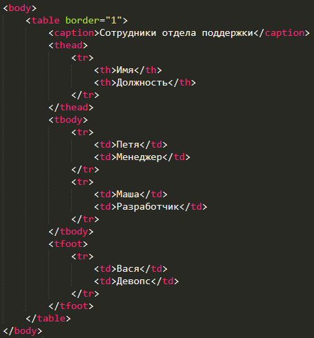

# Таблицы

Таблица объявляется с помощью тега `<table>`
Строки объявляются с помощью тегов `<tr>`

Ячейки в строке объявляются с помощью тегов `<th>` для заголовков и `<td>` для данных

Структура:
- `<table>`
    - `<tr>` - первая строка
        - `<th>` Заголовочная ячейка 1 `</th>`
        - `<th>` Заголовочная ячейка 2 `</th>`
    - `</tr>`
    - `<tr>` - вторая строка
        - `<td>` Ячейка 1 `</td>`
        - `<td>` Ячейка 2 `</td>`
    - `</tr>`
- `</table>`

### Дополнительные данные
Заголовок таблицы задается с помощью тега `<caption>`
```html
<table>
    <caption>Моя любимая таблица</caption>
    ...
</table>
```

---
## Объединение ячеек

Ячейки объединяются с помощью добавления атрибутов `colspan` и `rowspan`

Объединение ячеек нескольких колонок производится с помощью добавления в тег `<th>` атрибута `colspan`, которому присваивается значение с количеством ячеек, которые следует объединить
```html
<th colspan=2>Текст</th>
```

Объединение ячеек нескольких строк производится с помощью добавления в тег `<th>` атрибута `rowspan`, которому присваивается количество строк, текущую ячейку которых требуется объединить
```html
<table>
    <tr>
        <th rowspan="3">Порции</th>
        <td>Маленькая (150 г.)</td>
    </tr>
    <tr>
        <td>Средняя (250 г.)</td>
    </tr>
    <tr>
        <td>Большая (2400 г.)</td>
    </tr>
</table>
```

Пример (см. в превью моде):

<table border=2>
    <tr>
        <th rowspan="3">Порции</th>
        <td>Маленькая (150 г.)</td>
    </tr>
    <tr>
        <td>Средняя (250 г.)</td>
    </tr>
    <tr>
        <td>Большая (2400 г.)</td>
    </tr>
</table>

---
## Дополнительные смысловые теги

- `<thead>` - Обозначает заголовок таблицы, может существовать для каждой таблицы в единственном экземпляре
- `<tbody>` - Обозначает тело таблицы
- `<tfoot>` - Обозначает последнюю строчку таблицы. Где бы не находился тег в таблице, при выводе строка с этим тегом будет последней в таблице


